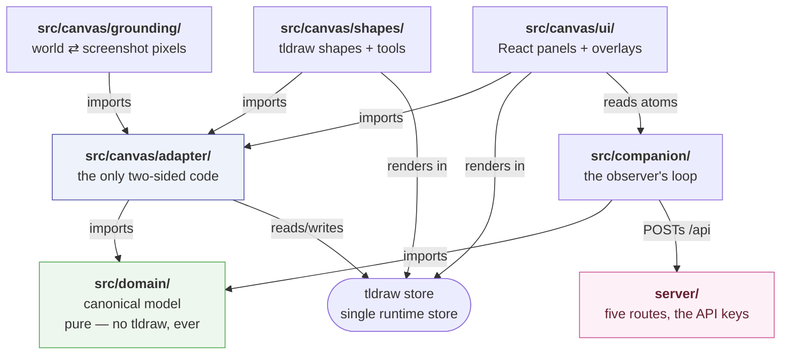
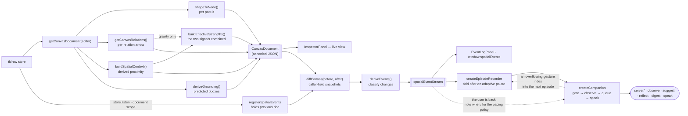
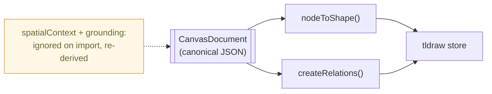

# Codemap

A file-by-file map of `llm-spatial-context`, for anyone — human or model — who needs to
find where something lives before changing it. This is the **where**; the
[`README.md`](./README.md) is the **why**. When a table entry raises a "but why is it done
that way?", the linked README section answers it.

## How to read this

The canonical model owns what things _are_. tldraw is the single runtime store and renders
them. The **adapter** is the only code that touches both sides. Everything the model reports
about a canvas — proximity influence, relations, effective strength, screenshot grounding — is
**derived on read** from the tldraw store, never a second copy of state that could drift.
`canvasDiff.ts` is the one module that needs a _previous_ state, and it gets one by being
handed two documents rather than by keeping a log. Exactly one place in the app holds those
two documents — `adapter/spatialEvents.ts`, which diffs them on every store change and feeds
the event stream. So there is still no second copy of canvas state: only a copy of the
_previous_ view of it, one diff deep.

So the mental model is one direction of trust:

> `src/domain` (pure meaning) ← `src/canvas/adapter` (the bridge) ← `src/canvas/{shapes,grounding,ui}` (tldraw runtime + React)

## Tech stack

| Concern     | Choice                                                                            |
| ----------- | --------------------------------------------------------------------------------- |
| UI          | React 19; `generative-loaders` for the companion's activity + text-stream loaders |
| Canvas      | tldraw 5.3 (store, persistence, arrows/bindings, `toImage`)                       |
| Build / dev | Vite 8 (`@` → `src/`), the server on `tsx watch`, both under `concurrently`       |
| Language    | TypeScript 5.9, strict, `noEmit`                                                  |
| Server      | Hono 4 on `@hono/node-server` — two routes, only to hold the API keys             |
| Models      | `@anthropic-ai/sdk` for the observer, `openai` for the voice                      |
| Tests       | Vitest 4 — `node` env by default, `jsdom` opt-in via docblock                     |
| Lint/format | ESLint 10 (flat config) + Prettier (tabs, no-semi, single, width 100)             |
| Storage     | tldraw IndexedDB `persistenceKey` — no database, and none of the canvas leaves it |

## Architecture at a glance

`src/companion/` imports `@/domain` and nothing from `src/canvas/` — the one thing it needs from
the canvas (what an episode's node ids refer to) is **injected** by `Canvas.tsx` as a function,
not imported. That is what keeps the whole loop testable without an editor.

`src/domain/**` may **not** import `tldraw`/`@tldraw/*`. That boundary is the whole point of
the split, so `eslint.config.js` enforces it with `no-restricted-imports` rather than leaving
it to code review.

## Data flow

**Read** — the canonical document is a derived view, rebuilt on every read, so nothing can
fall out of sync with the store:

The companion is the second consumer of that stream and the only one that acts on it. It reads
the document too, but only through `readEpisodeContext` — to turn the episode's ids into note
text — never to reconstruct canvas state the events already carry.

**Write / import** — rebuilding the canvas from canonical JSON in a single undo step. The two
derived layers are output-only: whatever `spatialContext` / `grounding` an imported document
carried is ignored and recomputed from the nodes.

## The four layers of context

A `CanvasDocument` keeps four kinds of claim apart so a reader can tell them apart instead of
receiving them pre-mixed. See the README's
[Four layers of context](./README.md#four-layers-of-context) for the reasoning.

| Layer                       | JSON location                                | Owning code                                          |
| --------------------------- | -------------------------------------------- | ---------------------------------------------------- |
| Node spatial state          | `nodes[].spatial`, `nodes[].contextualField` | `domain/node.ts`                                     |
| Spatially derived context   | `spatialContext.influences`                  | `domain/spatialInfluence.ts`                         |
| Explicit semantic relations | `relations` (incl. `gravity`)                | `canvas/adapter/relations.ts`, `domain/canvas.ts`    |
| Visual grounding            | `grounding` (`nodes` + `relations`)          | `canvas/grounding/*`, types in `domain/grounding.ts` |

The first three speak in **canvas coordinates**; `grounding` speaks in **screenshot pixels** —
which is why it is its own layer rather than extra fields on `spatial`.

`spatialContext.effectiveStrengths` (`domain/effectiveStrength.ts`) is **not** a fifth layer. It
makes no new claim about the canvas — each row is a function of the two layers above it, carried
beside the inputs it used and labelled with the function that produced it — so it is a _reading_ of
the layers, not one of them.

Spatial **events** (`domain/events.ts`) are not a layer either, for a stronger reason: they aren't in
the document at all. A `CanvasDocument` describes the canvas at one instant; an event describes a
_transition between two instants_, so it lives in the stream and never in the JSON. Every event is a
restatement of something already visible in a diff of two documents — which is what keeps the
document the single source of truth and the stream a view of its changes.

## Directory & file reference

### `src/domain/` — the canonical model (pure, no tldraw)

| File                   | Responsibility                                                                                                            | Key exports                                                                                                                                                                                                        |
| ---------------------- | ------------------------------------------------------------------------------------------------------------------------- | ------------------------------------------------------------------------------------------------------------------------------------------------------------------------------------------------------------------ |
| `node.ts`              | The `CanvasNode` model — content, spatial state, optional contextual field, visual, metadata                              | `CanvasNode`, `PostItNode`, `SpatialProperties`, `ContextualField`, `VisualProperties`, `NodeMetadata`, `createPostItNode`, `POST_IT_DEFAULT_*`                                                                    |
| `canvas.ts`            | The root `CanvasDocument`, the explicit `Relation` record, and how a gravity is read                                      | `CanvasDocument`, `Relation`, `CanvasMetadata`, `CanvasId`, `RelationId`, `clampGravity`, `DEFAULT_RELATION_GRAVITY`                                                                                               |
| `spatialInfluence.ts`  | Derived proximity math — rotation-aware centre, distance, linear falloff, all directed pairs                              | `nodeCenter`, `distanceBetweenNodes`, `calculateSpatialInfluence`, `calculateSpatialInfluences`, `buildSpatialContext`, `SpatialContext`, `SpatialInfluence`, `Point`, `DISTANCE_PRECISION`, `INFLUENCE_PRECISION` |
| `effectiveStrength.ts` | The one place the two strength signals combine — swappable strategies, clamped-sum pair gravity                           | `buildEffectiveStrengths`, `EffectiveStrength`, `CombineStrategy`, `StrategyName`, `STRATEGIES`, `DEFAULT_STRATEGY`, `INTENT_WEIGHTED`, `PRODUCT`, `LIFT`, `INTENT_WEIGHT`                                         |
| `canvasDiff.ts`        | The only module with a notion of _before_ — compares two documents; keeps no listener or log of its own                   | `diffCanvas`, `CanvasDiff`, `CanvasChange`, `PairDelta`, `Delta`, `RelationEndpoints`                                                                                                                              |
| `events.ts`            | Restates a `CanvasDiff` as an ordered event list — structural events + classified pair events                             | `deriveEvents`, `SpatialEvent`, `PairSnapshot`, `STRONG_PROXIMITY`, `WEAK_PROXIMITY`                                                                                                                               |
| `eventStream.ts`       | In-process subscribable buffer of events (no WebSockets); the app-wide singleton lives here                               | `createEventStream`, `spatialEventStream`, `SpatialEventStream`, `EventListener`, `DEFAULT_BUFFER_SIZE`                                                                                                            |
| `episode.ts`           | The observer's unit — a stream folded into one gesture after a pause, plus the local significance gate                    | `buildEpisodeSummary`, `isTrivialEpisode`, `createEpisodeRecorder`, `episodeNodes`, `EpisodeSummary`, `EpisodePairChange`, `Schedule`, `EPISODE_IDLE_MS`, `TRIVIAL_INFLUENCE_EPSILON`, `EPISODE_BUFFER_LIMIT`      |
| `idleBackoff.ts`       | How long that pause should be — raised past the quiet that turned out not to be an ending, eased back when a remark lands | `createIdleBackoff`, `IdleBackoff`, `IdleBackoffOptions`, `IDLE_BACKOFF_STEP_MS`, `IDLE_BACKOFF_MARGIN_MS`, `IDLE_BACKOFF_CAP_MS`                                                                                  |
| `grounding.ts`         | Types only for the grounding layer (screenshot-pixel regions)                                                             | `Grounding`, `GroundedNodeRegion`, `ImageSize`, `VisualId`                                                                                                                                                         |
| `index.ts`             | Barrel — the single `@/domain` import surface used by the adapter and UI                                                  | re-exports all of the above                                                                                                                                                                                        |

### `src/canvas/adapter/` — the only code that knows both sides

`adapter.ts`, `ids.ts`, `richText.ts` use **type-only** tldraw imports so round-trip tests run
without a DOM.

| File                  | Responsibility                                                                                                                             | Key exports                                                                                                                                                                                                           |
| --------------------- | ------------------------------------------------------------------------------------------------------------------------------------------ | --------------------------------------------------------------------------------------------------------------------------------------------------------------------------------------------------------------------- |
| `adapter.ts`          | The projection: `shapeToNode` / `nodeToShape`, plus defensive `shape.meta` read/write helpers                                              | `shapeToNode`, `nodeToShape`, `readNodeMeta`, `writeNodeMeta`, `readNodeContextualField`, `writeNodeContextualField`, `contextualFieldPatch`, `PageTransform`                                                         |
| `canvasView.ts`       | Assembles the whole `CanvasDocument` from the current page — the one place a document is built                                             | `getCanvasDocument`, `useCanvasDocument`                                                                                                                                                                              |
| `relations.ts`        | Relation ⇄ arrow projection; reads bound arrows into `Relation`s, rebuilds them on import, owns gravity                                    | `getCanvasRelations`, `createRelations`, `isRelationArrow`, `relationType`, `relationGravity`, `setRelationGravity`, `selectedRelationArrowIds`, `RELATION_META_KEY`, `RELATION_GRAVITY_META_KEY`, `ARROW_SHAPE_TYPE` |
| `relationGeometry.ts` | Measures each relation arrow's drawn path — world-space bounds + a point **on** the curve. Never throws                                    | `getRelationGeometry`                                                                                                                                                                                                 |
| `contextualField.ts`  | Editor-side writes for the contextual field (set/clear radius, with history mark)                                                          | `setContextualFieldRadius`, `selectedPostItIds`                                                                                                                                                                       |
| `metadata.ts`         | Non-derivable node state via tldraw side-effects — `createdAt` / `updatedAt` / `createdBy`, `meta.relation`                                | `registerNodeMetadata`, `restoringNodes`                                                                                                                                                                              |
| `spatialEvents.ts`    | Drives the pure `diffCanvas` from live edits — holds the previous document, diffs on store change, emits                                   | `registerSpatialEvents`                                                                                                                                                                                               |
| `episodeContext.ts`   | What an episode's ids refer to — resolves `NodeId`s to note text and collects the relations standing on them                               | `readEpisodeContext`                                                                                                                                                                                                  |
| `episodeValidity.ts`  | Whether the board still bears an episode out — the reading half of the staleness check, in the rounded-centre frame a move was recorded in | `readEpisodeValidity`                                                                                                                                                                                                 |
| `ids.ts`              | Identity mapping: `NodeId` ⇄ `TLShapeId` (and the relation equivalents), tldraw-runtime-free                                               | `nodeIdToShapeId`, `shapeIdToNodeId`, `relationIdToShapeId`, `shapeIdToRelationId`, `createNodeId`                                                                                                                    |
| `richText.ts`         | Pure plain-text ⇄ rich-text conversion (formatting is intentionally lossy on rebuild)                                                      | `plainTextToRichText`, `richTextToPlainText`                                                                                                                                                                          |

### `src/canvas/shapes/` — the tldraw projection of a post-it

| File                  | Responsibility                                                                                   | Key exports                                                                                                     |
| --------------------- | ------------------------------------------------------------------------------------------------ | --------------------------------------------------------------------------------------------------------------- |
| `postItShape.ts`      | Type-only shape definition (`'post-it'`, deliberately distinct from domain `'post_it'`)          | `POST_IT_SHAPE_TYPE`, `PostItShape`, `isPostItShape`                                                            |
| `postItStyles.ts`     | Raw-hex `StyleProp`s (avoids theme-dependent colours to keep the round trip lossless) + swatches | `PostItFillStyle`, `PostItStrokeStyle`, `PostItTextColorStyle`, `POST_IT_FILL_SWATCHES`, `POST_IT_INK_SWATCHES` |
| `PostItShapeUtil.tsx` | The `ShapeUtil` — geometry, resize, double-click edit, render. Holds no canonical truth          | `PostItShapeUtil`                                                                                               |
| `PostItTool.ts`       | The "drop a post-it" tool — builds a `CanvasNode` first, then projects it                        | `PostItTool`                                                                                                    |
| `RelationTool.ts`     | 3-line subclass of tldraw's `ArrowShapeTool`; its identity is what stamps `meta.relation`        | `RelationTool`, `RELATION_TOOL_ID`                                                                              |

### `src/canvas/grounding/` — node ⇄ screenshot pixels

Every decision that could put a box in the wrong place lives in a pure function; only
`groundedExport.ts` touches the browser.

| File                 | Responsibility                                                                                                    | Key exports                                                                                                                                                            |
| -------------------- | ----------------------------------------------------------------------------------------------------------------- | ---------------------------------------------------------------------------------------------------------------------------------------------------------------------- |
| `projection.ts`      | World ⇄ image-pixel geometry — rotated corners, export bounds (nodes **and** arrows), measured scale, bbox        | `nodeCorners`, `groundingProjection`, `imageScale`, `toImagePoint`, `nodeImageQuad`, `nodeImageAabb`, `relationImagePoint`, `relationImageAabb`, `GroundingProjection` |
| `grounding.ts`       | Builds the `Grounding` layer — nodes and relations, predicted on read, measured on export — + the PNG's badges    | `deriveGrounding`, `buildGrounding`, `predictedImageSize`, `groundedDocument`, `relationAnnotations`, `formatGravity`, `EXPORT_PIXELS_PER_WORLD_UNIT`                  |
| `visualId.ts`        | `N1/N2/N3…` for nodes and `R1/R2…` for arrows, in reading order — a label is a position, not an identity          | `assignVisualIds`, `assignRelationVisualIds`, `GroundedNode`, `GroundedRelation`                                                                                       |
| `annotationLayer.ts` | Draws outlines, label badges and gravity badges onto a 2D context (typed structurally so a recorder can stand in) | `drawGroundingLayer`, `GroundingContext`, `Annotation`, `RelationAnnotation`, `GROUNDING_PADDING`, `BOX_STROKE_WIDTH`, `LABEL_FONT_SIZE`                               |
| `groundedExport.ts`  | The browser export path — render via `editor.toImage`, composite annotations, save PNG + JSON                     | `buildGroundedScreenshot`, `exportGroundedScreenshot`, `GroundedScreenshot`                                                                                            |

### `src/` and `src/canvas/` — app shell & wiring

| File                         | Responsibility                                                                                                                                                            | Key exports                                                    |
| ---------------------------- | ------------------------------------------------------------------------------------------------------------------------------------------------------------------------- | -------------------------------------------------------------- |
| `main.tsx`                   | React entry point — mounts `<App/>` into `#root`                                                                                                                          | —                                                              |
| `App.tsx`                    | Thin shell that renders `<Canvas/>`                                                                                                                                       | `App`                                                          |
| `canvas/Canvas.tsx`          | The `<Tldraw>` wrapper — `persistenceKey`, `onMount` (registers metadata + the event stream, returns a disposer, dev `window.editor` / `spatialEvents` / `seedDemoScene`) | `Canvas`                                                       |
| `canvas/config.tsx`          | Module-scope registration of shape utils, tools, UI overrides, and custom components — including the four-tool toolbar                                                    | `customShapeUtils`, `customTools`, `uiOverrides`, `components` |
| `canvas/dev/seedScenario.ts` | Dev-only helper that lays out the MVP 1 §8 demonstration scene (three post-its, one field)                                                                                | `seedDemoScene`                                                |
| `index.css`                  | Global styles + `tldraw.css` import                                                                                                                                       | —                                                              |

### `src/canvas/ui/` — React panels & overlays

| File                           | Responsibility                                                                                                           | Key exports                                                                                                         |
| ------------------------------ | ------------------------------------------------------------------------------------------------------------------------ | ------------------------------------------------------------------------------------------------------------------- |
| `theme.ts`                     | Panel chrome as tldraw theme tokens — the one place colours, radii, shadows and the mono font are defined                | `panelChrome`, `readoutBox`, `caption`, `panelButton`, `numberInput`, `switchRow`, `MONO`, `FIELD_INK`, `fieldTint` |
| `InspectorDock.tsx`            | The `SharePanel` rail: the ⋯ popover trigger and the Canonical JSON toggle, with the Inspector beneath                   | `InspectorDock`                                                                                                     |
| `InspectorPanel.tsx`           | Live canonical JSON, Copy/Import, grounded-screenshot export, the three strength tables, and the event log               | `InspectorPanel`                                                                                                    |
| `CompanionBar.tsx`             | The `TopPanel` chip: latest comment, thinking indicator, transcript popover                                              | `CompanionBar`                                                                                                      |
| `CompanionQueue.tsx`           | The backlog behind the bar — one dismissable chip per gesture still waiting to be spoken about                           | `CompanionQueue`                                                                                                    |
| `CompanionFocusOverlay.tsx`    | The spotlight — a soft region and a ring on each note the remark being spoken is about                                   | `CompanionFocusOverlay`                                                                                             |
| `CompanionFocusCamera.tsx`     | Follows that spotlight with the camera. Renders nothing; the one member of the overlay composite that writes             | `CompanionFocusCamera`                                                                                              |
| `CompanionTranscriptPanel.tsx` | Everything the companion has said this session, newest last, behind the chip                                             | `CompanionTranscriptPanel`                                                                                          |
| `CompanionControls.tsx`        | The companion's three switches — AI observation gates the model call, Voice gates only playback, Follow gates the camera | `CompanionControls`                                                                                                 |
| `AgentThinkingIndicator.tsx`   | The hint shown while the companion works, naming which job it is on rather than spinning                                 | `AgentThinkingIndicator`                                                                                            |
| `ViewSettingsPopover.tsx`      | The ⋯ button and its four switches (fields, observation, voice, follow)                                                  | `ViewSettingsPopover`                                                                                               |
| `EventLogPanel.tsx`            | Live view of the spatial event stream (newest first, Clear); reads the module-scope singleton                            | `EventLogPanel`                                                                                                     |
| `PostItStylePanel.tsx`         | Custom StylePanel — hosts the contextual-field and gravity controls + colour swatch rows                                 | `PostItStylePanel`                                                                                                  |
| `ContextualFieldControl.tsx`   | Radius input for the selection (draft held, committed on blur/Enter/unmount)                                             | `ContextualFieldControl`                                                                                            |
| `RelationGravityControl.tsx`   | Gravity input for the selected relation arrows (same draft/commit mechanics, no clear)                                   | `RelationGravityControl`                                                                                            |
| `ContextualFieldOverlay.tsx`   | `OnTheCanvas` overlay drawing each node's field as a circle, behind shapes                                               | `ContextualFieldOverlay`                                                                                            |
| `InfluenceBadges.tsx`          | Per-node `→` / `←` / distance badges for the single selected node                                                        | `InfluenceBadges`                                                                                                   |
| `ContextualFieldToggle.tsx`    | Show/hide switch for the field overlay                                                                                   | `ContextualFieldToggle`                                                                                             |
| `contextualFieldVisibility.ts` | Module-scope tldraw `atom` shared by the toggle and overlay (not persisted, not canonical)                               | `showContextualFields`                                                                                              |

### `src/companion/` — the AI observer's loop

Subscribes to the [event stream](./README.md#event-stream), groups events into episodes, and — when a pause reveals a meaningful change — asks the model whether to say something. The model call and the speech synthesis live in `server/` (Hono routes) so the API key never reaches the browser.

| File                | Responsibility                                                                                                                                                                                                                                                                                                   | Key exports                                                                                                                                                                                            |
| ------------------- | ---------------------------------------------------------------------------------------------------------------------------------------------------------------------------------------------------------------------------------------------------------------------------------------------------------------- | ------------------------------------------------------------------------------------------------------------------------------------------------------------------------------------------------------ |
| `companion.ts`      | The orchestrator: episode → gate → observe → **queue** → speak. Every gesture gets a slot, the thinking runs in parallel, and a single pump — the one thing here that touches `voice` — speaks them in gesture order. Also the drop rules (too late, or no longer true), the overflow carry, and the pacing loop | `createCompanion`, `DEFAULT_HISTORY_SIZE`, `TRANSCRIPT_LIMIT`                                                                                                                                          |
| `thoughtQueue.ts`   | The queue's pure half: where a thought goes, whether it is still worth saying, what its chip is called, and the four constants that size all of it                                                                                                                                                               | `isStillTrue`, `describeGesture`, `insertByPriority`, `pairKey`, `EpisodeValidity`, `QUEUE_LIMIT`, `MAX_REMARK_AGE_MS`, `HEAD_OF_LINE_MS`, `MIN_DWELL_MS`                                              |
| `companionState.ts` | Module-scope tldraw atoms — the three switches, which job the companion is on (`observing` / `composing`), the transcript, the remark currently being spoken, the notes it is about, the backlog behind it, and the pause it has settled into                                                                    | `observationEnabled`, `voiceEnabled`, `followEnabled`, `companionStage`, `companionTranscript`, `companionUtterance`, `companionFocus`, `companionQueue`, `cancelThought`, `companionPacing`, `Pacing` |
| `observerClient.ts` | The seam to the model: POST an episode and its context, receive speak/comment                                                                                                                                                                                                                                    | `ObserverClient`, `createHttpObserverClient`, `OBSERVE_TIMEOUT_MS`                                                                                                                                     |
| `voiceClient.ts`    | The seam to TTS: POST the text, play the returned audio, and report when playback starts, how far through it is, and — on every path, exactly once — that it is over                                                                                                                                             | `VoiceClient`, `SpeakOptions`, `createHttpVoiceClient`, `SPEAK_TIMEOUT_MS`                                                                                                                             |
| `reveal.ts`         | Which words have been said at a given fraction of playback — position-weighted, since the mp3 carries no word timings                                                                                                                                                                                            | `spokenPrefix`                                                                                                                                                                                         |

### `server/` — the five routes that hold the API keys

The repo was backend-free by design. This exists only because the companion calls two paid
APIs and neither key may reach the browser. Every route **fails safe**: a bad body, a missing
key or a rejected request degrades to that agent's own safe answer — silence, a decline, an
empty reflection — rather than to an error at the user. Config is
read _inside_ each function, never in a module constant — ESM evaluates these modules before
`index.ts` calls `process.loadEnvFile()`, so a constant would bake the default and ignore `.env`.

| File               | Responsibility                                                                                                                                                                       | Key exports                                                                                             |
| ------------------ | ------------------------------------------------------------------------------------------------------------------------------------------------------------------------------------ | ------------------------------------------------------------------------------------------------------- |
| `index.ts`         | The Hono app — `/api/observe`, `/api/suggest`, `/api/reflect`, `/api/digest`, `/api/speak`, a 256 KB body cap on each, `dist/` in production                                         | —                                                                                                       |
| `observe.ts`       | One episode in, a speak / stay-silent decision out                                                                                                                                   | `observe`, `ObserverDecision`                                                                           |
| `suggest.ts`       | The whole board in, a grouping proposal out                                                                                                                                          | `suggest`                                                                                               |
| `reflect.ts`       | The whole board in, a reading plus notes to add out                                                                                                                                  | `reflect`                                                                                               |
| `digest.ts`        | The whole board in, a standing understanding out — themes, a reading, a session narrative, open tensions. Speaks to nobody; only ever stored                                         | `digest`                                                                                                |
| `prompt.ts`        | The observer's character — system prompt, decision schema, an episode as prose, and the verdict read back                                                                            | `SYSTEM_PROMPT`, `DECISION_SCHEMA`, `renderEpisode`, `interpretDecision`, `observerModel`               |
| `suggestPrompt.ts` | The suggester's character, request rendering, and the validation that drops hallucinated ids                                                                                         | `SUGGEST_SYSTEM_PROMPT`, `renderSuggestRequest`, `interpretGrouping`                                    |
| `reflectPrompt.ts` | The reflection's character and its persona registry — the one place a lens is defined, `impact` included                                                                             | `REFLECT_SYSTEM_PROMPT`, `REFLECT_PERSONAS`, `renderReflection`, `interpretReflection`                  |
| `digestPrompt.ts`  | The digest's character and the harder validation its answer needs, since it is stored and reused rather than spoken once — a hallucinated theme must not name notes that don't exist | `DIGEST_SYSTEM_PROMPT`, `DIGEST_SCHEMA`, `renderDigestRequest`, `interpretUnderstanding`, `digestModel` |
| `speak.ts`         | Text-to-speech; mp3 bytes back, capped at `MAX_SPEAK_CHARS`                                                                                                                          | `synthesize`, `MAX_SPEAK_CHARS`                                                                         |

Three agents that once each carried their own copy of the asking now share it:

| File                          | Responsibility                                                                                                                                                                          | Key exports                                                         |
| ----------------------------- | --------------------------------------------------------------------------------------------------------------------------------------------------------------------------------------- | ------------------------------------------------------------------- |
| `prompting/callStructured.ts` | The one SDK call. Structured output, **adaptive thinking**, and the fallback whenever an answer can't be trusted                                                                        | `callStructured`, `MAX_TOKENS`                                      |
| `prompting/boardRender.ts`    | A board written for a model — one `named()` where there were three, and the block format the suggester and reflection share                                                             | `named`, `renderBoardBlocks`, `renderRecentComments`, `boardLabels` |
| `prompting/fragments.ts`      | Prompt paragraphs more than one agent needs, so a missing rule looks missing                                                                                                            | `CANVAS_PRIMER`                                                     |
| `prompting/remark.ts`         | Is this actually a remark? The second layer against scaffolding leaking into spoken text                                                                                                | `isCleanRemark`, `REMARK_HARD_LIMIT`                                |
| `prompting/types.ts`          | The payload shapes the browser POSTs                                                                                                                                                    | `BoardSummaryPayload`, `RelationContext`                            |
| `prompting/understanding.ts`  | One renderer for the standing understanding, shared by the observer, the suggester and the reflection, so all three read it in the same words and are told the same way how stale it is | `renderUnderstanding`                                               |

> **Thinking is on, deliberately.** It was disabled to save latency until the eval showed what
> that cost: structured output constrains generation to valid JSON, so reasoning the model
> could not place was absorbed into the open `comment` string — schema-valid remarks carrying
> `"...worth noticing.}  Actually: {"`, up to 1040 characters, on their way to the voice.
> Turning it on removed the leak and did not measurably cost latency. See `evals/`.

### Config & tooling (root)

| File               | Responsibility                                                                                  |
| ------------------ | ----------------------------------------------------------------------------------------------- |
| `package.json`     | Scripts (`dev`/`build`/`test`/`lint`/…), deps, Node `>=22.12.0`                                 |
| `vite.config.ts`   | Vite + React plugin, `@` → `./src`, and the Vitest block (`node` env, `src/**/*.test.{ts,tsx}`) |
| `tsconfig.json`    | Strict TS, `noEmit`, bundler resolution, `@/*` path mapping                                     |
| `eslint.config.js` | Flat config; **enforces** that `src/domain/**` cannot import tldraw                             |
| `index.html`       | Vite HTML entry loading `/src/main.tsx`                                                         |
| `.prettierrc`      | Tabs, no semicolons, single quotes, width 100                                                   |

### Tests (colocated `*.test.ts(x)`)

Three layers, because the pure layer alone shipped two bugs it couldn't see. See the README's
[Testing](./README.md#testing) section.

| Layer              | Files                                                                                                                                                                                                                                                                                               | Env     |
| ------------------ | --------------------------------------------------------------------------------------------------------------------------------------------------------------------------------------------------------------------------------------------------------------------------------------------------- | ------- |
| Pure               | `domain/{canvas,spatialInfluence,effectiveStrength,canvasDiff,events,eventStream,episode}.test.ts`, `companion/{renderEpisode,reveal,thoughtQueue}.test.ts`, `adapter/adapter.test.ts`, `adapter/relations.test.ts`, `grounding/{projection,grounding,visualId,annotationLayer,arrowAware}.test.ts` | `node`  |
| Real editor        | `adapter/editor.test.ts`, `adapter/relationEditor.test.ts`, `adapter/spatialEvents.test.ts`, `adapter/episodeValidity.test.ts`, `dev/seedScenario.test.ts`, `grounding/groundedExport.test.ts`, `companion/{companion,voiceClient}.test.ts`                                                         | `jsdom` |
| Rendered component | `ui/ContextualFieldControl.test.tsx`, `ui/RelationGravityControl.test.tsx`, `ui/ContextualFieldOverlay.test.tsx`, `ui/InfluenceBadges.test.tsx`, `ui/EventLogPanel.test.tsx`, `ui/Companion*.test.tsx`, `ui/AgentThinkingIndicator.test.tsx`                                                        | `jsdom` |

## Where to start reading

1. `src/domain/canvas.ts` — the four-layer document shape.
2. `src/domain/node.ts` — what a node is.
3. `src/canvas/adapter/canvasView.ts` — how the whole document is assembled (`getCanvasDocument`).
4. `src/canvas/adapter/adapter.ts` — the shape ⇄ node round trip.
5. `src/domain/events.ts` + `src/canvas/adapter/spatialEvents.ts` — how a change becomes an event.
6. `src/domain/episode.ts` + `src/companion/companion.ts` — how events become a remark.
7. `server/prompt.ts` — what the model is actually told.
8. `src/canvas/Canvas.tsx` + `src/canvas/config.tsx` — how it all mounts and registers.

## Key invariants

- **The domain never imports tldraw.** ESLint-enforced, not a convention.
- **Derived layers are output, not input.** `spatialContext`, `grounding` and `relations` are
  recomputed on every read and ignored on import — there is no second store to invalidate.
- **Absent ≠ zero/empty.** A missing `contextualField.radius` and a missing relation `type` are
  distinct claims from a zero radius or a `related_to` label; the code never defaults them.
  `gravity` is the one deliberate exception, and it isn't content: drawing an arrow is itself the
  full-strength claim, so absent means `1` — see `clampGravity`.
- **Proximity never becomes a relation.** `spatialContext` is what the layout implies;
  `relations` is only what the user drew and named.
- **A relation never becomes influence.** Its `gravity` is read from the arrow's meta alone, so
  distance can't move it and it can't move an `influences` row.
- **The two strength signals are never _conflated_** — which is weaker than never combined, and
  deliberately so. No `influences` row carries a `gravity` and no `relations` record carries an
  `influence`, so both layers read exactly as they did before a combined layer existed. The
  combination lives only in `spatialContext.effectiveStrengths`, where every row carries the two
  inputs it used and names the strategy that produced it, making it reproducible from the JSON.
- **Events are a record of change, not canvas state.** They are derived from a diff of two
  documents, never stored in one; the stream is in-memory, bounded and not persisted, and nothing
  reads it back to reconstruct a canvas. A subscriber that wants the current state reads the
  document.
- **One store subscription.** `registerSpatialEvents` is the only thing listening to the store for
  change detection, so every consumer sees the same ordered events. Its disposer is returned from
  `onMount` — dropping it would double every event under StrictMode.
- **Silence is an answer, not a failure.** The observer returns `{ speak, comment }` as structured
  output, and every failure path on the server — no key, bad body, rejected request — returns
  `speak: false` rather than throwing. Nothing in the loop distinguishes "had nothing to say" from
  "could not ask", by design: neither should interrupt the person thinking.
- **The companion holds no canvas state.** It reads the document only through `readEpisodeContext`,
  to turn ids into note text. Everything else it knows comes from the events, which is what makes
  `createCompanion` testable with a fake stream and no editor at all.
- **One thing speaks at a time, and it is the pump.** Observation, the proactive grouping, an
  on-demand reflection and the comment after an accepted edit all enqueue; none of them reaches
  `voice`. That is what makes "in gesture order, one at a time" a property of the structure
  rather than a rule four call sites have to keep remembering.
- **No API key reaches the browser.** The prompt, the model choice and both SDK calls live in
  `server/`; the client ships an episode and receives a verdict.
- **One Canvas is one tldraw page.** The page menu is hidden to keep that true.

## See also

- [`README.md`](./README.md) — the rationale behind every decision above, with the extension
  recipes ([Where to add things](./README.md#where-to-add-things)) and known trade-offs
  ([Known limitations](./README.md#known-limitations)).
