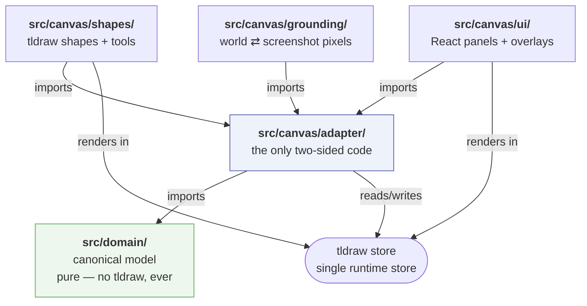
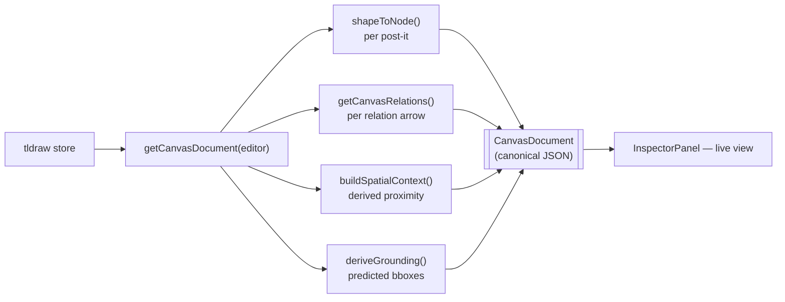
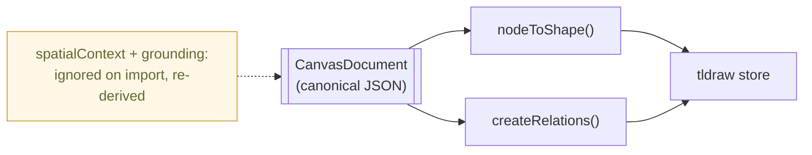

# Codemap

A file-by-file map of `llm-spatial-context`, for anyone — human or model — who needs to
find where something lives before changing it. This is the **where**; the
[`README.md`](./README.md) is the **why**. When a table entry raises a "but why is it done
that way?", the linked README section answers it.

## How to read this

The canonical model owns what things _are_. tldraw is the single runtime store and renders
them. The **adapter** is the only code that touches both sides. Everything the model reports
about a canvas — proximity influence, relations, screenshot grounding — is **derived on
read** from the tldraw store, never a second copy of state that could drift.

So the mental model is one direction of trust:

> `src/domain` (pure meaning) ← `src/canvas/adapter` (the bridge) ← `src/canvas/{shapes,grounding,ui}` (tldraw runtime + React)

## Tech stack

| Concern     | Choice                                                                |
| ----------- | --------------------------------------------------------------------- |
| UI          | React 19                                                              |
| Canvas      | tldraw 5.3 (store, persistence, arrows/bindings, `toImage`)           |
| Build / dev | Vite 8 (`@` → `src/`)                                                 |
| Language    | TypeScript 5.9, strict, `noEmit`                                      |
| Tests       | Vitest 4 — `node` env by default, `jsdom` opt-in via docblock         |
| Lint/format | ESLint 10 (flat config) + Prettier (tabs, no-semi, single, width 100) |
| Storage     | tldraw IndexedDB `persistenceKey` — no backend                        |

## Architecture at a glance

`src/domain/**` may **not** import `tldraw`/`@tldraw/*`. That boundary is the whole point of
the split, so `eslint.config.js` enforces it with `no-restricted-imports` rather than leaving
it to code review.

## Data flow

**Read** — the canonical document is a derived view, rebuilt on every read, so nothing can
fall out of sync with the store:

**Write / import** — rebuilding the canvas from canonical JSON in a single undo step. The two
derived layers are output-only: whatever `spatialContext` / `grounding` an imported document
carried is ignored and recomputed from the nodes.

## The four layers of context

A `CanvasDocument` keeps four kinds of claim apart so a reader can tell them apart instead of
receiving them pre-mixed. See the README's
[Four layers of context](./README.md#four-layers-of-context) for the reasoning.

| Layer                       | JSON location                                | Owning code                                          |
| --------------------------- | -------------------------------------------- | ---------------------------------------------------- |
| Node spatial state          | `nodes[].spatial`, `nodes[].contextualField` | `domain/node.ts`                                     |
| Spatially derived context   | `spatialContext.influences`                  | `domain/spatialInfluence.ts`                         |
| Explicit semantic relations | `relations` (incl. `gravity`)                | `canvas/adapter/relations.ts`, `domain/canvas.ts`    |
| Visual grounding            | `grounding`                                  | `canvas/grounding/*`, types in `domain/grounding.ts` |

The first three speak in **canvas coordinates**; `grounding` speaks in **screenshot pixels** —
which is why it is its own layer rather than extra fields on `spatial`.

## Directory & file reference

### `src/domain/` — the canonical model (pure, no tldraw)

| File                  | Responsibility                                                                               | Key exports                                                                                                                                                           |
| --------------------- | -------------------------------------------------------------------------------------------- | --------------------------------------------------------------------------------------------------------------------------------------------------------------------- |
| `node.ts`             | The `CanvasNode` model — content, spatial state, optional contextual field, visual, metadata | `CanvasNode`, `PostItNode`, `SpatialProperties`, `ContextualField`, `VisualProperties`, `NodeMetadata`, `createPostItNode`, `POST_IT_DEFAULT_*`                       |
| `canvas.ts`           | The root `CanvasDocument`, the explicit `Relation` record, and how a gravity is read         | `CanvasDocument`, `Relation`, `CanvasMetadata`, `CanvasId`, `RelationId`, `clampGravity`, `DEFAULT_RELATION_GRAVITY`                                                  |
| `spatialInfluence.ts` | Derived proximity math — rotation-aware centre, distance, linear falloff, all directed pairs | `nodeCenter`, `distanceBetweenNodes`, `calculateSpatialInfluence`, `calculateSpatialInfluences`, `buildSpatialContext`, `SpatialContext`, `SpatialInfluence`, `Point` |
| `grounding.ts`        | Types only for the grounding layer (screenshot-pixel regions)                                | `Grounding`, `GroundedNodeRegion`, `ImageSize`, `VisualId`                                                                                                            |
| `index.ts`            | Barrel — the single `@/domain` import surface used by the adapter and UI                     | re-exports all of the above                                                                                                                                           |

### `src/canvas/adapter/` — the only code that knows both sides

`adapter.ts`, `ids.ts`, `richText.ts` use **type-only** tldraw imports so round-trip tests run
without a DOM.

| File                 | Responsibility                                                                                              | Key exports                                                                                                                                                                                                           |
| -------------------- | ----------------------------------------------------------------------------------------------------------- | --------------------------------------------------------------------------------------------------------------------------------------------------------------------------------------------------------------------- |
| `adapter.ts`         | The projection: `shapeToNode` / `nodeToShape`, plus defensive `shape.meta` read/write helpers               | `shapeToNode`, `nodeToShape`, `readNodeMeta`, `writeNodeMeta`, `readNodeContextualField`, `writeNodeContextualField`, `contextualFieldPatch`, `PageTransform`                                                         |
| `canvasView.ts`      | Assembles the whole `CanvasDocument` from the current page — the one place a document is built              | `getCanvasDocument`, `useCanvasDocument`                                                                                                                                                                              |
| `relations.ts`       | Relation ⇄ arrow projection; reads bound arrows into `Relation`s, rebuilds them on import, owns gravity     | `getCanvasRelations`, `createRelations`, `isRelationArrow`, `relationType`, `relationGravity`, `setRelationGravity`, `selectedRelationArrowIds`, `RELATION_META_KEY`, `RELATION_GRAVITY_META_KEY`, `ARROW_SHAPE_TYPE` |
| `contextualField.ts` | Editor-side writes for the contextual field (set/clear radius, with history mark)                           | `setContextualFieldRadius`, `selectedPostItIds`                                                                                                                                                                       |
| `metadata.ts`        | Non-derivable node state via tldraw side-effects — `createdAt` / `updatedAt` / `createdBy`, `meta.relation` | `registerNodeMetadata`, `restoringNodes`                                                                                                                                                                              |
| `ids.ts`             | Identity mapping: `NodeId` ⇄ `TLShapeId` (and the relation equivalents), tldraw-runtime-free                | `nodeIdToShapeId`, `shapeIdToNodeId`, `relationIdToShapeId`, `shapeIdToRelationId`, `createNodeId`                                                                                                                    |
| `richText.ts`        | Pure plain-text ⇄ rich-text conversion (formatting is intentionally lossy on rebuild)                       | `plainTextToRichText`, `richTextToPlainText`                                                                                                                                                                          |

### `src/canvas/shapes/` — the tldraw projection of a post-it

| File                  | Responsibility                                                                                   | Key exports                                                                                                     |
| --------------------- | ------------------------------------------------------------------------------------------------ | --------------------------------------------------------------------------------------------------------------- |
| `postItShape.ts`      | Type-only shape definition (`'post-it'`, deliberately distinct from domain `'post_it'`)          | `POST_IT_SHAPE_TYPE`, `PostItShape`, `isPostItShape`                                                            |
| `postItStyles.ts`     | Raw-hex `StyleProp`s (avoids theme-dependent colours to keep the round trip lossless) + swatches | `PostItFillStyle`, `PostItStrokeStyle`, `PostItTextColorStyle`, `POST_IT_FILL_SWATCHES`, `POST_IT_INK_SWATCHES` |
| `PostItShapeUtil.tsx` | The `ShapeUtil` — geometry, resize, double-click edit, render. Holds no canonical truth          | `PostItShapeUtil`                                                                                               |
| `PostItTool.ts`       | The "drop a post-it" tool — builds a `CanvasNode` first, then projects it                        | `PostItTool`                                                                                                    |
| `RelationTool.ts`     | 3-line subclass of tldraw's `ArrowShapeTool`; its identity is what stamps `meta.relation`        | `RelationTool`, `RELATION_TOOL_ID`                                                                              |

### `src/canvas/grounding/` — node ⇄ screenshot pixels

Every decision that could put a box in the wrong place lives in a pure function; only
`groundedExport.ts` touches the browser.

| File                 | Responsibility                                                                                                    | Key exports                                                                                                                                           |
| -------------------- | ----------------------------------------------------------------------------------------------------------------- | ----------------------------------------------------------------------------------------------------------------------------------------------------- |
| `projection.ts`      | World ⇄ image-pixel geometry — rotated corners, export bounds, measured scale, bbox                               | `nodeCorners`, `groundingProjection`, `imageScale`, `toImagePoint`, `nodeImageQuad`, `nodeImageAabb`, `relationImagePoint`, `GroundingProjection`     |
| `grounding.ts`       | Builds the `Grounding` layer (predicted on read; measured on export) + the PNG's relation badges                  | `deriveGrounding`, `buildGrounding`, `predictedImageSize`, `groundedDocument`, `relationAnnotations`, `formatGravity`, `EXPORT_PIXELS_PER_WORLD_UNIT` |
| `visualId.ts`        | `N1/N2/N3…` in reading order — a label is a position, not an identity                                             | `assignVisualIds`, `GroundedNode`                                                                                                                     |
| `annotationLayer.ts` | Draws outlines, label badges and gravity badges onto a 2D context (typed structurally so a recorder can stand in) | `drawGroundingLayer`, `GroundingContext`, `Annotation`, `RelationAnnotation`, `GROUNDING_PADDING`, `BOX_STROKE_WIDTH`, `LABEL_FONT_SIZE`              |
| `groundedExport.ts`  | The browser export path — render via `editor.toImage`, composite annotations, save PNG + JSON                     | `buildGroundedScreenshot`, `exportGroundedScreenshot`, `GroundedScreenshot`                                                                           |

### `src/` and `src/canvas/` — app shell & wiring

| File                | Responsibility                                                                                 | Key exports                                                    |
| ------------------- | ---------------------------------------------------------------------------------------------- | -------------------------------------------------------------- |
| `main.tsx`          | React entry point — mounts `<App/>` into `#root`                                               | —                                                              |
| `App.tsx`           | Thin shell that renders `<Canvas/>`                                                            | `App`                                                          |
| `canvas/Canvas.tsx` | The `<Tldraw>` wrapper — `persistenceKey`, `onMount` (registers metadata, dev `window.editor`) | `Canvas`                                                       |
| `canvas/config.tsx` | Module-scope registration of shape utils, tools, UI overrides, and custom components           | `customShapeUtils`, `customTools`, `uiOverrides`, `components` |
| `index.css`         | Global styles + `tldraw.css` import                                                            | —                                                              |

### `src/canvas/ui/` — React panels & overlays

| File                           | Responsibility                                                                                | Key exports              |
| ------------------------------ | --------------------------------------------------------------------------------------------- | ------------------------ |
| `InspectorPanel.tsx`           | Live canonical JSON, Copy/Import, grounded-screenshot export, the relation + influence tables | `InspectorPanel`         |
| `PostItStylePanel.tsx`         | Custom StylePanel — hosts the contextual-field and gravity controls + colour swatch rows      | `PostItStylePanel`       |
| `ContextualFieldControl.tsx`   | Radius input for the selection (draft held, committed on blur/Enter/unmount)                  | `ContextualFieldControl` |
| `RelationGravityControl.tsx`   | Gravity input for the selected relation arrows (same draft/commit mechanics, no clear)        | `RelationGravityControl` |
| `ContextualFieldOverlay.tsx`   | `OnTheCanvas` overlay drawing each node's field as a circle, behind shapes                    | `ContextualFieldOverlay` |
| `InfluenceBadges.tsx`          | Per-node `→` / `←` / distance badges for the single selected node                             | `InfluenceBadges`        |
| `ContextualFieldToggle.tsx`    | Show/hide switch for the field overlay                                                        | `ContextualFieldToggle`  |
| `contextualFieldVisibility.ts` | Module-scope tldraw `atom` shared by the toggle and overlay (not persisted, not canonical)    | `showContextualFields`   |

### Config & tooling (root)

| File               | Responsibility                                                                                  |
| ------------------ | ----------------------------------------------------------------------------------------------- |
| `package.json`     | Scripts (`dev`/`build`/`test`/`lint`/…), deps, Node `>=22.12.0`                                 |
| `vite.config.ts`   | Vite + React plugin, `@` → `./src`, and the Vitest block (`node` env, `src/**/*.test.{ts,tsx}`) |
| `tsconfig.json`    | Strict TS, `noEmit`, bundler resolution, `@/*` path mapping                                     |
| `eslint.config.js` | Flat config; **enforces** that `src/domain/**` cannot import tldraw                             |
| `index.html`       | Vite HTML entry loading `/src/main.tsx`                                                         |
| `.prettierrc`      | Tabs, no semicolons, single quotes, width 100                                                   |

### Tests (colocated `*.test.ts(x)`)

Three layers, because the pure layer alone shipped two bugs it couldn't see. See the README's
[Testing](./README.md#testing) section.

| Layer              | Files                                                                                                                                                                   | Env     |
| ------------------ | ----------------------------------------------------------------------------------------------------------------------------------------------------------------------- | ------- |
| Pure               | `domain/{canvas,spatialInfluence}.test.ts`, `adapter/adapter.test.ts`, `adapter/relations.test.ts`, `grounding/{projection,grounding,visualId,annotationLayer}.test.ts` | `node`  |
| Real editor        | `adapter/editor.test.ts`, `adapter/relationEditor.test.ts`, `grounding/groundedExport.test.ts`                                                                          | `jsdom` |
| Rendered component | `ui/ContextualFieldControl.test.tsx`, `ui/RelationGravityControl.test.tsx`, `ui/ContextualFieldOverlay.test.tsx`, `ui/InfluenceBadges.test.tsx`                         | `jsdom` |

## Where to start reading

1. `src/domain/canvas.ts` — the four-layer document shape.
2. `src/domain/node.ts` — what a node is.
3. `src/canvas/adapter/canvasView.ts` — how the whole document is assembled (`getCanvasDocument`).
4. `src/canvas/adapter/adapter.ts` — the shape ⇄ node round trip.
5. `src/canvas/Canvas.tsx` + `src/canvas/config.tsx` — how it all mounts and registers.

## Key invariants

- **The domain never imports tldraw.** ESLint-enforced, not a convention.
- **Derived layers are output, not input.** `spatialContext`, `grounding` and `relations` are
  recomputed on every read and ignored on import — there is no second store to invalidate.
- **Absent ≠ zero/empty.** A missing `contextualField.radius` and a missing relation `type` are
  distinct claims from a zero radius or a `related_to` label; the code never defaults them.
  `gravity` is the one deliberate exception, and it isn't content: drawing an arrow is itself the
  full-strength claim, so absent means `1` — see `clampGravity`.
- **Proximity never becomes a relation.** `spatialContext` is what the layout implies;
  `relations` is only what the user drew and named.
- **A relation never becomes influence.** Its `gravity` is read from the arrow's meta alone, so
  distance can't move it and it can't move `spatialContext`. The two strength signals are reported
  side by side and never combined — there is no `effectiveInfluence`.
- **One Canvas is one tldraw page.** The page menu is hidden to keep that true.

## See also

- [`README.md`](./README.md) — the rationale behind every decision above, with the extension
  recipes ([Where to add things](./README.md#where-to-add-things)) and known trade-offs
  ([Known limitations](./README.md#known-limitations)).
