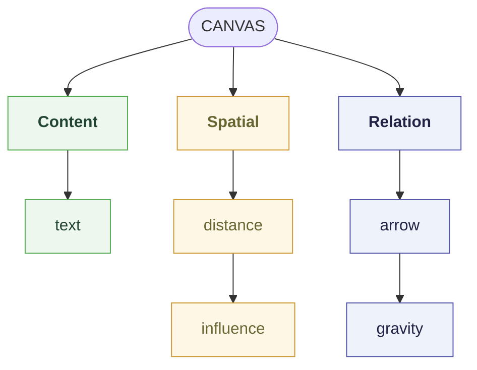
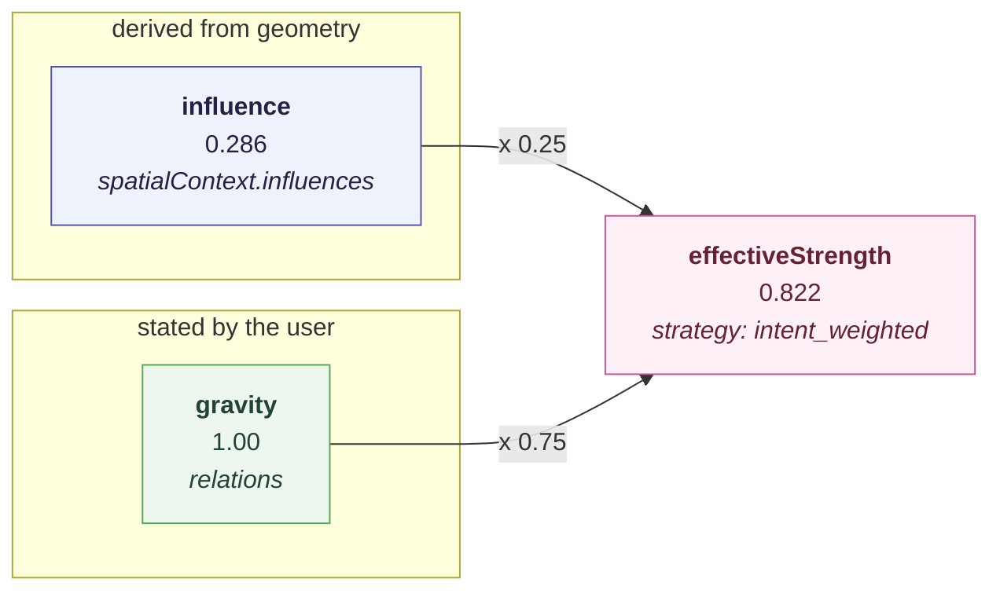

# llm-spatial-context

An experiment in giving an LLM **grounded spatial context** about a [tldraw](https://tldraw.dev) infinite canvas. A canonical model describes _what exists_ on the canvas — nodes, their geometry, and what the user explicitly connected — across four deliberately-separated layers, so a reader (a person or a model) can reach the same entity **semantically** (its text), **spatially** (where it sits and what its field reaches), **relationally** (what the user connected, named, and how strongly), and **visually** (which pixels of a screenshot it occupies). Derived data is never stored, and proximity never silently becomes a relation. The two strength signals — spatial influence and relational gravity — are combined into a single ranking number only in a third layer that carries both of its inputs and names the function it used, so they are never _conflated_.

Built on tldraw, Vite, React 19 and TypeScript.


## Contents

- [Why this exists](#why-this-exists)
- [Getting started](#getting-started)
- [Scripts](#scripts)
- [Architecture](#architecture)
  - [Contextual field](#contextual-field)
  - [Four layers of context](#four-layers-of-context)
  - [Relations](#relations)
  - [Relational gravity](#relational-gravity)
  - [Effective strength](#effective-strength)
  - [Change detection](#change-detection)
  - [Event stream](#event-stream)
  - [Grounded screenshot](#grounded-screenshot)
- [Layout](#layout)
- [Where to add things](#where-to-add-things)
- [Known limitations](#known-limitations)
- [Testing](#testing)
- [Persistence](#persistence)
- [A note on the tldraw license](#a-note-on-the-tldraw-license)
- [Docs](#docs)

For a file-by-file map of the code — every module, its key exports, and the test layout — see [`CODEMAP.md`](./CODEMAP.md).

## Why this exists

I started from one question:

> **What changes when a 2D canvas is not treated merely as a visual interface, but as a structured representation of human thought that an AI can directly reason over?**

Answering it means breaking a canvas into signals and keeping them apart, because they are not the same kind of evidence:



| Signal                 | What does it tell us?                                | Strength          |
| ---------------------- | ---------------------------------------------------- | ----------------- |
| **Content**            | What does the node say?                              | Semantic evidence |
| **Spatial influence**  | How are nodes organized in space?                    | Implicit signal   |
| **Relational gravity** | What relationship did the user explicitly establish? | Explicit signal   |

**These must not collapse into a single notion of "relationship."** A node can be semantically related to another without being spatially close; two nodes can be spatially close with no explicit relationship; and an explicit relation can hold between two nodes that are far apart. Keeping them distinct is what lets a model reason across all three without losing track of where each claim came from — the mechanics are in [Four layers of context](#four-layers-of-context).

The fourth layer answers a different question: which _pixels_ is this node? A model handed a screenshot and a JSON document would otherwise have to work that out from world coordinates, and inferring it is exactly the guess the rest of this design removes — so [`grounding`](#grounded-screenshot) states the mapping instead.

Hand-run against Gemini with a grounded PNG and the canonical JSON — nothing from those sessions is checked into this repo — the model grounded each entity to its visual object, recovered the direction of the explicit relations, and reasoned about proximity. The useful part was a disagreement: the arrows assert `N4 → N1` and `N3 → N2`, while the notes' content implies `N4 → N3 → N1 → N2`. The representation let the model **see both structures instead of averaging them into one graph**.

The canvas below reproduces that structure — nothing from the sessions themselves survives, so this is a reconstruction rather than the artifact the model was handed:


Where this is pointed — no AI is built:

- a canvas as a **spatial computational substrate** rather than a rendering surface, where structure comes from configuration rather than containment;
- an AI **observing how the representation changes** as the user works — a node moved, an arrow drawn — rather than answering prompts. The [event stream](#event-stream) such an observer would subscribe to now exists; nothing subscribes to it, and a text edit still produces no event;
- that AI **writing entities and relations back** into the space it is reasoning about.

The prototype deliberately attempts none of the reasoning half. It establishes a substrate those questions can be tested on. The full research note — the argument, the Gemini tests and the trajectory — is in [`docs/why.md`](./docs/why.md).

## Getting started

Requires Node `>=22.12.0` (a tldraw SDK requirement).

```bash
npm install
npm run dev
```

Open http://localhost:5173.

## Scripts

| Script                 | Does                                                 |
| ---------------------- | ---------------------------------------------------- |
| `npm run dev`          | Vite dev server with HMR (`--host`, also on the LAN) |
| `npm run build`        | Typecheck, then production build to `dist/`          |
| `npm run preview`      | Serve the production build locally                   |
| `npm run typecheck`    | `tsc --noEmit`                                       |
| `npm test`             | Vitest, single run                                   |
| `npm run test:watch`   | Vitest in watch mode                                 |
| `npm run lint`         | ESLint over the repo                                 |
| `npm run lint:fix`     | ESLint with autofix                                  |
| `npm run format`       | Prettier write                                       |
| `npm run format:check` | Prettier check (no writes)                           |

## Architecture

A **Node** is any entity that can exist on the canvas. `post_it` is the first concrete type, not the abstraction — `image`, `article`, `agent` and the rest join the same model later without the Canvas abstraction changing.

The canonical model owns what things _are_. tldraw renders and manipulates them. Nothing crosses between the two except through the adapter.

```
Canonical Node  ──▶  Tldraw Adapter  ──▶  Tldraw Shape
      ▲                                        │
      └──────────  user interaction  ◀─────────┘
```

tldraw's store is the single runtime store; the canonical Canvas is a derived view over it (`getCanvasDocument`). There is no second store to fall out of step, so undo/redo, IndexedDB persistence and cross-tab sync all keep working untouched. The state tldraw can't express — `createdAt`, `updatedAt`, `createdBy`, `contextualField` — lives in `shape.meta`, which tldraw persists and syncs but never reads. A shape prop would need a schema migration and a `persistenceKey` bump; meta needs neither.

### Contextual field

A Node may declare a `contextualField.radius` in world coordinates. From that, `spatialInfluence.ts` derives how much one Node influences another: linear falloff over centre-to-centre distance, `1` when the centres coincide and `0` at or beyond the radius.

Influence is **derived, never stored**. It is a function of two Nodes' geometry plus the source's radius, so moving a Node changes its context with no state to invalidate — nothing writes an `influence` field into a Node. It is also directional: two Nodes with different radii influence each other by different amounts, without any semantic relation being involved.

Two details worth knowing:

- The radius is optional and **never defaulted**. A Node with no field exerts no influence, which is a different claim from a Node with a small one.
- The centre is rotation-aware. `SpatialProperties.rotation` is applied about the top-left corner, so `x + width / 2` is only the centre of an unrotated box.

#### Seeing it

The field was the one piece of spatial state with no visual form — set as a number, read back as numbers, so "does this note reach that one?" meant comparing a distance column against a radius by hand. The **Contextual fields** switch (top right, beside _Canonical JSON_) draws it: a dashed circle per Node that has a radius, every one at once, so overlapping reach is something you see rather than compute.


Selecting a Node **highlights its field**: a solid ring instead of a dashed one, a denser fill, and drawn last so no other circle's translucent fill washes over its outline. Solid-versus-dashed is a difference in _kind_ rather than only in degree, which is what keeps the highlight legible once you zoom out far enough that every outline is a hairline. With several Nodes selected, each of their fields is highlighted.

The overlay is a viewing aid and nothing else. It reads the canonical model, writes nothing, and infers nothing — no lines between Nodes, no distance labels, no shading of intersections. Overlap shows because translucent circles overlap.

Three details carry the design:

- **The circle is centred on `nodeCenter`, not the box midpoint.** Drawn independently it would agree for every unrotated Node and quietly lie about every rotated one — the picture has to be honest about the numbers beside it, so both come from the same helper. Pinned by a test.
- **It renders through `components.OnTheCanvas`**, which sits inside the camera-transformed layer and _behind_ the shapes. Position is therefore in page coordinates with no zoom arithmetic, fields never cover a note's text, and — because `editor.toImage` renders only shapes — the overlay cannot reach a grounded screenshot. That last point is a fact about tldraw's internals rather than our code, so it is verified in pixels rather than trusted.
- **Only the border width divides by the zoom.** The layer is CSS-transformed, so an untouched 1px border would render 4px thick at 4× zoom and vanish zoomed out. A dashed border's dash length follows its thickness, so the dashes need no separate handling.

Visibility lives in a module-scope atom (`contextualFieldVisibility.ts`) because the switch and the overlay are siblings with no common React parent — `components` is declared at module scope so tldraw doesn't remount the editor on every render. It is deliberately not persisted and not canonical: a preference about looking, not a fact about the canvas.

##### Influence scores

Selecting a single Node also badges every Node it is spatially related to with the score, in **both directions**:

```
→ 0.167     how much the selected Node reaches this one
← 0.375     how much this one reaches the selected Node
500 u       centre-to-centre distance — symmetric, so stated once
```


Both numbers appear even when one is `0.000`, because that zero is information: "its field reaches you, yours doesn't reach it" is a real and easily-missed state. It is the same reasoning that keeps out-of-range rows in `spatialContext` rather than dropping them. A Node out of range _both_ ways gets no badge at all — it isn't affected, and a canvas of zeroes would bury the pairs that carry a signal.

The incoming direction is what makes a Node with **no radius of its own** legible: it exerts nothing, but things still reach it, so selecting it shows `→ 0.000` against real incoming scores instead of an empty canvas.

Three constraints shape the badges:

- **The numbers come from `spatialContext`, never recomputed.** `InspectorPanel` reads from the document so the table and the JSON can't round differently; a badge that did its own arithmetic would be a third answer with no way to tell which of the three was right. Pinned by a test that compares the rendered text to the document's own value.
- **Badges only for a single selection.** `→` and `←` are relative to _the_ selected Node; with two selected there is no referent for either arrow. Multi-selection keeps the field highlights and drops the badges.
- **Badges counter-scale, circles don't.** A circle is a world-space object and should grow with the canvas. Text that grows becomes a billboard, so badges hold a constant size on screen at every zoom.

A score is not a relation and doesn't claim to be one — it reports a derived spatial quantity, exactly as `spatialContext` does. **Proximity still never becomes a relation**; that is what the Relation tool below is for.

### Four layers of context

A `CanvasDocument` deliberately separates what it knows about a canvas into four kinds of claim, so a reader — a person or a model — can tell them apart instead of receiving them pre-mixed:

| Layer                       | Where                                        | Answers                                                        |
| --------------------------- | -------------------------------------------- | -------------------------------------------------------------- |
| Node spatial state          | `nodes[].spatial`, `nodes[].contextualField` | Where is it, how big, how far does it reach?                   |
| Spatially derived context   | `spatialContext.influences`                  | How far apart are they, how strongly does one reach the other? |
| Explicit semantic relations | `relations`                                  | What did the user connect, call it, and how strongly?          |
| Visual grounding            | `grounding`                                  | Which region of a screenshot is this node?                     |

The first three speak in **canvas coordinates**; `grounding` speaks in **screenshot pixels**. That is why it is its own layer rather than extra fields on `spatial`.

A fifth array, `spatialContext.effectiveStrengths`, is deliberately _not_ a fifth layer. It introduces no new claim about the canvas — every row is a function of the two layers above it, carried alongside the inputs it used — so it is a **reading** of the layers rather than one of them. See [Effective strength](#effective-strength).

Spatial **events** are not a layer either, and for a firmer reason: they are not in the document at all. All four layers describe the canvas at one instant; an event describes a _transition between two_, so it lives in the [event stream](#event-stream) and never in the JSON.

```json
{
	"nodes": {
		"node-a": { "spatial": { "x": 300, "y": 200, "…": "…" }, "contextualField": { "radius": 500 } }
	},
	"relations": {
		"relation-1": { "from": "node-a", "to": "node-b", "gravity": 1, "type": "causes" }
	},
	"spatialContext": {
		"influences": [{ "source": "node-a", "target": "node-b", "distance": 326, "influence": 0.349 }],
		"effectiveStrengths": [
			{
				"source": "node-a",
				"target": "node-b",
				"influence": 0.349,
				"gravity": 1,
				"effectiveStrength": 0.837,
				"strategy": "intent_weighted",
				"relations": ["relation-1"]
			}
		]
	},
	"grounding": {
		"image": { "width": 1998, "height": 1140 },
		"nodes": { "N1": { "nodeId": "node-a", "bbox": [80, 80, 560, 400] } }
	}
}
```

**Proximity never becomes a relation.** Nothing infers `related_to`, or any other type, from two Nodes being close. `relations` is what the user said; `spatialContext` is what the layout implies and nobody named. The reverse holds too: a relation between two distant Nodes creates no influence, and its `gravity` is unmoved by how far apart they are.

### Relations

The **Relation** tool (`r`) draws an arrow from one post-it to another, and that act is the statement: _these two are related_. Double-click the arrow and type `causes`, and the label becomes the relation's `type`.

```json
"relations": {
	"sjWvRRvYRGPbJy9i9h44-": {
		"id": "sjWvRRvYRGPbJy9i9h44-",
		"from": "cdhJU…",
		"to": "QhEky…",
		"gravity": 1,
		"type": "causes"
	}
}
```

`type` is **optional and never defaulted**. An unlabelled arrow means "connected, and the user didn't say why", which is a different claim from `related_to` — inventing that word is precisely the inference this model refuses to make, so an empty label produces no `type` key at all. Same rule as `contextualField`.

**The tool is ours; the shape is tldraw's.** `ArrowShapeTool` is a five-line `StateNode`, so `RelationTool` subclasses it and inherits the entire interaction — drag-to-connect, binding, precise anchors, elbow routing, label editing, re-routing when a Node moves. A bespoke `relation` shape would have meant reimplementing `ArrowShapeUtil` to arrive back at an arrow. `ShapeUtil.canBind()` already defaults to `true`, so post-its were bindable from the start; only the projection was missing.

What separates a relation from a decorative arrow is `meta.relation`, stamped by `getInitialMetaForShape` while the Relation tool is the current one — not the shape type (both are `arrow`) and not the styling, so restyling an arrow never changes what it means. **A plain arrow between two post-its stays decoration.**

Relations are **derived on read**, like everything else: `getCanvasRelations` walks the page's relation arrows and reads their bindings, so there is no second store, and moving a Node, redrawing an arrow or undoing all produce a correct document with nothing to invalidate. Four guards decide what counts, and each is a claim about what a relation is:

| Rejected                   | Because                                                                                           |
| -------------------------- | ------------------------------------------------------------------------------------------------- |
| One end loose              | A half-drawn gesture doesn't relate two things, and guessing the other end would invent the claim |
| Bound to a non-Node        | A draw or geo shape isn't a canonical entity                                                      |
| Both ends on the same Node | Follows `calculateSpatialInfluences`, which omits self-pairs                                      |
| Untagged arrow             | Decoration is not an assertion                                                                    |

Nothing in the projection looks at geometry, and nothing in `spatialInfluence.ts` looks at arrows. That is what keeps the two layers answering different questions.

### Relational gravity

A relation carries a **gravity**: how strongly the user says these two are related, `0`–`1`. It is a second strength signal, and the point of it is that it is _not_ the first one:

```text
Spatial influence   → what the arrangement suggests.
Relational gravity  → what the user explicitly expressed.
```

Select a relation arrow and a **Relational gravity** input appears in the style panel. Drawing an arrow starts it at `1`.

So both numbers can describe the same pair, and disagree:

```text
N4 → N1
  distance:           484
  spatial influence:  0.032   ← the layout barely connects them
  relational gravity: 1.0     ← the user says they are strongly related
```

That is not an inconsistency to reconcile — it is the information. The two layers that own these numbers never contaminate each other: **no influence row ever carries a `gravity`, and no relation record ever carries an `influence`.** Collapsing them _in place_ would destroy the only thing this model is trying to preserve — the difference between what the user _stated_ and what can be _inferred_ from how they arranged things — so the Inspector shows them as separate tables.

A reader who wants one number to rank by gets it from a third layer, [`effectiveStrengths`](#effective-strength), which carries both inputs and names the function that combined them. The rule is **never conflated**, not never combined: nothing that was visible before the combined layer existed has been taken away by it.

Gravity is **directional**, like the rest of the record: `from → to` at `1.0` says nothing about `to → from`, which exists only if the user drew that arrow too. Spatial influence stays symmetric in existence (every pair gets a row) and asymmetric in value (it depends on the source's radius).

`gravity` is **required and defaulted**, where `type` is optional and never defaulted. That difference is deliberate: `type` is a _word the user chose_, and inventing one would invent the claim. Gravity is the strength of the _gesture itself_, and deliberately connecting two notes is the strongest assertion the tool offers — so `1` is what the act already meant, not a guess. `clampGravity` in `src/domain/canvas.ts` owns that reading: out-of-range values are clamped, junk falls back to `1`, and a deliberate `0` is kept, exactly as a `contextualField.radius` of `0` is.

It lives in `shape.meta.gravity`, flat beside the `relation` flag rather than nested inside it — `meta.relation` has to stay exactly `true` for `isRelationArrow` to accept it, so nesting would turn every arrow already on a canvas into decoration. An arrow drawn before this field existed reads back at `1.0`.

The schema stays minimal on purpose. No relation vocabulary (`explains`, `supports`, `contradicts`) yet: `from`, `to`, `gravity` and an optional user-typed `type` are what the canvas can honestly report today.

`spatialContext` is assembled in `getCanvasDocument`, the one place a document is built, which is why it needs no invalidation logic and no manual trigger — a move, a resize, a radius change, an addition or a deletion all produce a fresh document. It is **output, not input**: importing a document ignores whatever `spatialContext` it carried and derives a new one from the Nodes.

Every directed pair is emitted, including out-of-range ones at `influence: 0`, so "these are too far apart" stays distinguishable from "this pair wasn't considered". That is `N² − N` entries. Distance is rounded to whole units and influence to three decimals in the document; `calculateSpatialInfluences` stays exact for anything doing further arithmetic.

### Effective strength

Two numbers per pair answers "what is close?" and "what did the user say?", but not "**what should I look at first?**". `spatialContext.effectiveStrengths` answers that third question — one row per directed pair the user connected, carrying both inputs, the combination, and the name of the function that produced it.


The figure is the whole argument in one screenshot. Proximity ranks `Pricing model → Colour of the logo` highest at `0.571`; the user never connected them. `Pricing model → Churn in Q3` sits at half that influence — but it is the pair they drew an arrow between, and effective strength puts it at `0.822`.

```json
"effectiveStrengths": [
	{
		"source": "aaaaaaaa-…",
		"target": "bbbbbbbb-…",
		"influence": 0.286,
		"gravity": 1,
		"effectiveStrength": 0.822,
		"strategy": "intent_weighted",
		"relations": ["relation-1"]
	}
]
```



**Multiplication is the one function that cannot work here**, and MVP 0 asks for it by name. `influence × gravity` with gravity normalised to `0`–`1` gives `0.35 × 1.0 = 0.35` — a full-strength relation leaves a distant pair exactly as weak as drawing nothing would have, which fails the requirement in the same paragraph that asks for it. So the amplification lives in the **function**, not in the data, and gravity keeps the `0`–`1` scale `clampGravity` argues for:

| Strategy                    | Function                          | `0.286 / 1.0` | Why it exists                                                          |
| --------------------------- | --------------------------------- | ------------- | ---------------------------------------------------------------------- |
| `intent_weighted` (default) | `infl·(1−w) + grav·w`, `w = 0.75` | `0.822`       | Intent counts 3× proximity, and High+High still outranks Low+High      |
| `product`                   | `infl × gravity`                  | `0.286`       | The literal formula — kept so its failure is a test, not an argument   |
| `lift`                      | `infl + grav·(1 − infl)`          | `1.0`         | Amplifies, but saturates: every default-gravity pair reaches exactly 1 |

Which is why the strategy **travels with every row**. `INTENT_WEIGHT = 0.75` is a calibration guess — nothing consumes these numbers yet, so there is nothing to tune it against — and a reader who disagrees can see which function they are disagreeing with instead of having to reverse-engineer it.

Each row is also **reproducible from itself**: it is combined from the same rounded `influence` printed beside it, so `strategy(row.influence, row.gravity)` returns `row.effectiveStrength` exactly. A row combined from a hidden extra three decimals would not survive that check, and checking is the point.

Only connected pairs get a row. A pair with no arrow has no intent to combine, and emitting one with `gravity: 0` would invent the claim — **absent is not zero here either**. A pair at `influence: 0` _does_ get a row, because "explicitly related despite distance" is the state the whole separation exists for. Two arrows the same way have their gravities **summed and clamped**: saying a thing twice cannot mean it less, which is what rules out averaging.

### Change detection

`diffCanvas(before, after)` is the only part of the model with any notion of _before_, and it acquires one the cheapest way available: by being handed two documents. **The function itself keeps no listener, no log and no history** — a caller that wants change detection holds its own snapshots. That is what keeps `CanvasDocument` a pure function of the store, with nothing to invalidate.

Exactly one caller does hold them: `registerSpatialEvents`, which turns this diff into the [event stream](#event-stream). The split is the point — the comparison stays pure and testable in `src/domain`, and the snapshot bookkeeping lives in the adapter, where a store subscription belongs.

It **reads** the derived layers rather than recomputing them, so a diff can never report a number that disagrees with the JSON the caller is holding. Comparison is exact equality on values the document already rounded, which makes the epsilon self-evident: a change too small to appear in the document cannot appear in a diff of it.

Eight change kinds come back — the seven the requirement implies, plus `relation_gravity_changed`, which it omits although the style panel already permits it:

```text
node_created · node_deleted · node_moved · contextual_field_changed
relation_created · relation_deleted · relation_rebound · relation_gravity_changed
```

Dragging a connected note away produces exactly the reading the requirement asks for — influence collapses, gravity does not move, and the combined number barely dips:

```json
{
	"changes": [
		{
			"kind": "node_moved",
			"node": "bbbbbbbb-…",
			"before": { "x": 680, "y": 400 },
			"after": { "x": 1520, "y": 400 }
		}
	],
	"pairs": [
		{
			"source": "aaaaaaaa-…",
			"target": "bbbbbbbb-…",
			"distance": { "before": 500, "after": 1340, "delta": 840 },
			"influence": { "before": 0.286, "after": 0, "delta": -0.286 },
			"effectiveStrength": { "before": 0.822, "after": 0.75, "delta": -0.072 }
		}
	]
}
```

`gravity` is **absent from that pair**, because it did not change. The arrow is still there at full strength; only the layout moved.

Three decisions are worth naming:

**`node_moved` compares centres, not corners.** `spatial.rotation` is applied about the unrotated box's top-left, and a resize changes width or height — so a rotation and a resize each move the centre, and therefore every distance in the document, while `spatial.x`/`y` may not have changed at all. One kind covers all three honestly; comparing raw coordinates would miss two of them.

**`relation_rebound` is an update, not a delete plus a create.** `RelationId` derives from the arrow's shape id, which survives dragging one end onto a different note — so the relation's identity persists through a rebind, and the diff can say so.

**Actions and consequences are two lists, not a tree.** The requirement's examples read as `A moved closer to B → influence increased`, and for a single action that join is recoverable. What the diff must not do is _assert_ it: when two nodes both move, deciding which one caused a given pair's influence to rise is an inference, and inferring causality is exactly what the requirement rules out. So `changes` says what the user did, `pairs` says what the numbers did, and the arrow between them is left to a reader who can see whether it is warranted.

### Event stream

[`diffCanvas`](#change-detection) answers _what is different_ between two canvases. The event stream answers the next question — _what just happened_ — as an ordered, subscribable sequence a debug panel can render one line at a time, and a future AI observer (MVP 2) can consume without ever reconstructing spatial state from a screenshot.

It adds no new truth. `deriveEvents(diff)` restates a diff's two lists as events: the eight change kinds become **structural events**, and each pair's influence delta is _classified_ into the **spatial events** the diff carries but does not name.

```text
structural   node_created · node_deleted · node_moved · contextual_field_changed
             relation_created · relation_deleted · relation_rebound · relation_gravity_changed
spatial      field_entered · field_exited · influence_changed · proximity_changed
```

A pair's influence is the whole classifier. Crossing zero is a boundary — `field_entered` when influence rises from `0`, `field_exited` when it falls to it. A change with both ends inside the field is `influence_changed`. Crossing a `0.66` / `0.33` band edge while still in range is `proximity_changed` (`strong` / `weak`), which can accompany an `influence_changed`. A pair that only _appeared_ or _vanished_ is a created or deleted node — reported structurally, never as a spurious crossing. Every spatial event carries `previous` and `current` (`{ distance, influence }`), so a transition is legible without holding the surrounding snapshots.

The stream itself is deliberately small: an in-process, subscribable buffer, **no WebSockets**. `registerSpatialEvents(editor, stream)` is the one place the pure `diffCanvas` is driven by live edits — it holds the previous document, re-derives on every document-scope store change, diffs, and emits. In development the running stream is on `window.spatialEvents`, and `window.seedDemoScene()` lays out the walkthrough below. (The subscription is disposed on unmount, so StrictMode's double-mount does not attach two.)

**The walkthrough (`window.seedDemoScene()`, then drag B).** Three post-its; A carries a 500-unit field, B starts outside it, C sits inside. Drag B in from the right and the stream fills — `field_entered`, then `influence_changed` and `proximity_changed` as it strengthens — and ends on the state that is the whole point: B dragged far past the boundary, its influence gone, and the A → B relation still standing at full strength.


The panel shows all three signals diverging at once: spatial influence `A → B` is `0.000` at distance `1500`, yet relational gravity holds at `1.00` and effective strength stays `0.750`. The event log records how it got there — `relation_created`, then `field_exited` with `infl 0.70 → 0.00` — and never a `relation_deleted`, because moving a node cannot revoke a claim the user made. Proximity and intent are independent, and the stream reports them independently.

### Grounded screenshot

The other three layers speak in canvas coordinates — they say where a Node is and what reaches it. What none of them can say is which _pixels_ it occupies. A model handed a screenshot and the JSON has to work that out from world coordinates, and inferring it is exactly the kind of guess the rest of this design removes.

`grounding` closes that gap, and the **Grounded screenshot** button in the Inspector panel exports the image it describes: a PNG of the canvas with every Node outlined and labelled `N1`, `N2`, `N3`.


```json
"grounding": {
	"image": { "width": 1440, "height": 1477 },
	"nodes": {
		"N1": { "nodeId": "aeb30231-…", "bbox": [80, 80, 560, 400] },
		"N2": { "nodeId": "cb19cf1f-…", "bbox": [880, 160, 1360, 480] }
	}
}
```

The same Node is then reachable three ways: **semantic** (`content.text`), **spatial** (`spatial`, plus the derived `spatialContext`), and **visual** (`grounding.nodes[].bbox`).

`grounding` indexes **relations as well as Nodes**, keyed `R1`, `R2`… on the same terms:

```json
"relations": {
	"R1": { "relationId": "rel-a", "bbox": [344, 157, 1837, 1200], "badge": [887, 390] },
	"R2": { "relationId": "rel-b", "bbox": [560, 422, 3152, 1708], "badge": [2108, 1566] }
}
```

It was argued out at first, on the grounds that `relations` already names both endpoints by node id and `grounding.nodes` maps `N1`, `N2`… back to those ids — so the arrow in the picture was already joinable to the relation describing it. That is true of an arrow's **identity** and silent about its **pixels**, which is the one question this layer exists to answer. A model looking at two crossing curves cannot tell which is which from endpoint ids alone.

Leaving it out also forced the badge to be re-derivable from node centres, and [that is what broke it](#why-the-badge-is-measured-rather-than-derived).

**`spatial` and `grounding.bbox` are different coordinate systems, and the separation is the point.** `spatial` is the canvas — world units, an origin the camera can't move, unchanged by any export. `bbox` is one screenshot — pixels from that image's top-left, meaningless without the `image` it came with. A Node 900 world units down the canvas is 1880px down a 2×-scale PNG; conflating the two is the mistake this layer makes impossible.

`bbox` is `[x1, y1, x2, y2]` — opposite corners, not `[x, y, width, height]` — rounded to whole pixels, since a screenshot has no sub-pixel position to point at.

The layer is an _index, not an interpretation_. Every mark on it names something the JSON already states about something the user made: a Node's region, or the gravity they gave an arrow. Nothing _derived_ is drawn — no influence rings, no distance markers, no lines between Nodes that have none — because those claims live in `spatialContext`, and putting them on the image would mix a reading of the canvas into what is meant to be a lookup table between pixels and ids. Only the badges are filled, so the canvas underneath survives intact.

#### Why the badge is measured rather than derived

A relation's badge reads `R1 g 0.60`. The `g` is load-bearing, since an image already carries distances and sizes and a bare `0.60` beside an arrow could be read as any of them. The `R1` is load-bearing for a second reason, and it took a real export to notice: two relations at the default gravity produced two badges both reading `g 1.00`, so a reader could see _that_ there were two and never which was which.

The position used to be the **midpoint of the two Nodes' centres** — derived rather than measured, so a reader could recompute it from `nodes[].spatial` and check the badge instead of trusting it. That re-derivability was real, and it was bought at too high a price:


Those arrows are _bent_. A bend leaves the straight line between the two centres, so the derived midpoint is a point the curve never passes through — in the export that exposed this, both badges floated in open canvas, one of them directly above an unrelated Node's `N3` label where it read as that Node's gravity. **A badge naming the wrong thing is worse than one whose position has to be stated.**

So the arrow's real path is measured — `getArrowInfo` gives a point on the arc, and an elbow route is walked to half its arc length — and `grounding.relations[].badge` says where the badge ended up. The check a reader could do by recomputing, they now do by reading.

The same measurement fixed a second defect in that export. The export box was sized to the Nodes, while every shape on the page was drawn into it, so an arrow bowing outside the notes was **cut off at the edge of the PNG** with the rest of it still drawn. `groundingProjection` now unions the arrows' own bounds: in the canvas above the lowest note ends at y 780 and the lower arrow reaches y 874, which is 188px of image that used not to exist.

Reading arrow geometry means the grounding layer needs something the canonical model can't supply — a curve's position is not a function of its endpoints. That work lives in `src/canvas/adapter/relationGeometry.ts`, the layer that is allowed to see both sides, and it hands the pure layer plain world-space numbers. It also **never throws**: `getCanvasDocument` runs inside a reactive computed, and measuring an arrow resolves its label's fonts, which fails outright on an editor without `textOptions`. An arrow it can't measure is omitted, so the cost of that failure is one missing badge rather than the canvas.

Six things about it are worth knowing:

- **`grounding` is derived, never stored** — assembled in `getCanvasDocument` beside `spatialContext`, recomputed on every read, and **output, not input**: importing a document ignores whatever `grounding` it carried. It describes the screenshot the canvas _would_ export right now, which is knowable rather than guessed: the bounds come from the Nodes and the pixel ratio is fixed at 2, so `image` is `floor(bounds × 2)`. The export then measures the bitmap it actually produced and substitutes that, so a saved PNG + JSON pair always describes itself. A test pins the two together — the prediction and the measurement come out equal.
- **`N1` is a position, not an identity.** Moving a Node can renumber every label; the node id remains the only stable handle. A label exists so a short token can be pointed at in an image.
- **A rotated Node's `bbox` is looser than its outline.** Four numbers can't express a rotation, so the bbox is the smallest axis-aligned box containing the Node, while the outline drawn on the image follows the rotation. A test pins the bbox to the drawn quad's corners so the two can never disagree about which Node they describe.
- **The image covers every Node, not the viewport.** Bounds come from the Nodes themselves, expanded by `GROUNDING_PADDING`, so a Node parked far off screen is still in the picture. Grounding something that isn't visible would be worse than not grounding it.
- **The scale is measured, never assumed.** `toImage` reports the _logical_ size it rendered at, while `scale`, `pixelRatio`, flooring and the browser's maximum canvas size all sit between that and the actual blob. `imageScale` derives pixels-per-world-unit from the decoded bitmap, and throws if the height doesn't follow from the width — a box in the wrong place is worse than no box. Note it checks the _height in pixels_ rather than comparing the two axes' implied scales: the axes are floored independently, so those scales never quite agree, and the disagreement grows with the aspect ratio. Judging it against a fixed pixel budget rejects a wide canvas for being wide.
- **Only the export validates.** `buildGrounding` deliberately checks nothing, because `getCanvasDocument` runs inside a reactive computed — anything thrown while deriving a layer takes the editor down rather than showing a bad number. This follows `calculateSpatialInfluence`, which returns `0` for every degenerate input for the same reason: an unvalidated canvas is a normal state to be in, not an error to interrupt a render for.

## Layout

```
src/
  main.tsx                     React entry point
  App.tsx                      Thin shell, renders <Canvas />
  index.css                    Global styles + tldraw.css import
  domain/                      The canonical model — no tldraw imports, ever
    node.ts                    CanvasNode, spatial/visual/metadata, createPostItNode
    canvas.ts                  CanvasDocument — the four layers, Relation, clampGravity
    grounding.ts               Grounding types — screenshot pixels, not canvas units
    spatialInfluence.ts        Node centre, distance, influence, buildSpatialContext
    index.ts                   Barrel — the @/domain import surface
  canvas/
    Canvas.tsx                 The <Tldraw /> wrapper — persistence, onMount hook
    config.tsx                 Module-scope shape utils, tools, UI overrides and toolbar
    adapter/                   The only code that knows both sides
      adapter.ts               shapeToNode / nodeToShape — the round-trip pair
      ids.ts                   NodeId ⇄ TLShapeId
      richText.ts              plain text ⇄ rich text, kept pure
      relations.ts             arrow ⇄ Relation, gravity reads/writes, rebuilding on import
      canvasView.ts            getCanvasDocument(editor), useCanvasDocument()
      metadata.ts              createdAt / updatedAt side effects
      contextualField.ts       setContextualFieldRadius(editor, ids, radius)
    shapes/                    The tldraw projection of a post_it
      postItShape.ts           Shape type + guard (type-only tldraw imports)
      postItStyles.ts          Raw-hex StyleProps for fill / stroke / text
      PostItShapeUtil.tsx      Rendering, geometry, resize, text editing
      PostItTool.ts            Creates the Node first, then projects it
      RelationTool.ts          Subclasses ArrowShapeTool; tags what it draws
    grounding/                 Node ⇄ pixels, for the grounded screenshot
      visualId.ts              assignVisualIds — N1/N2/N3 in reading order
      projection.ts            World ⇄ image: bounds, rotated corners, bbox, measured scale
      grounding.ts             deriveGrounding / buildGrounding — image size + bboxes
      annotationLayer.ts       Draws the outlines, labels and gravity badges onto a 2D context
      groundedExport.ts        toImage, composite, save the PNG + JSON pair
    ui/
      InspectorPanel.tsx       Live canonical JSON, relation + influence tables, grounded export
      PostItStylePanel.tsx     Colour controls, and hosts the field and gravity controls
      ContextualFieldControl.tsx  Radius input for the selection
      RelationGravityControl.tsx  Gravity input for the selected relations
      ContextualFieldOverlay.tsx  Dashed reach circles, drawn behind the shapes
      InfluenceBadges.tsx         Both directions' scores, on the affected notes
      ContextualFieldToggle.tsx   The show/hide switch
      contextualFieldVisibility.ts  Module atom shared by the two above
```

Imports resolve `@/` to `src/`, e.g. `import { Canvas } from '@/canvas/Canvas'`.

**`src/domain` must never import tldraw.** That's the whole point of the split, so ESLint enforces it rather than leaving it to code review.

Test files (`*.test.ts`, `*.test.tsx`) sit next to the code they cover and are left out of the tree above for brevity. For the full file-by-file map — every module, its key exports, and the three test layers — see [`CODEMAP.md`](./CODEMAP.md).

## Where to add things

- **A new node type** → add it to `NodeType` in `src/domain/node.ts`, give it a shape util and tool under `src/canvas/shapes/`, and extend the adapter. The `Canvas` model itself shouldn't need to change.
- **Prototype logic that needs the editor** → the `onMount(editor)` callback in `src/canvas/Canvas.tsx`.
- **A new custom shape** → copy `src/canvas/shapes/PostItShapeUtil.tsx`, then register it in `customShapeUtils` in `src/canvas/config.tsx`.
- **A new custom tool** → copy `src/canvas/shapes/PostItTool.ts`, register it in `customTools`, add it to `uiOverrides` for its label and shortcut, and add a `TldrawUiMenuItem` to the `Toolbar` override so it actually appears (all three in `src/canvas/config.tsx`).
- **A different way of combining the two strength signals** → add a `CombineStrategy` to `STRATEGIES` in `src/domain/effectiveStrength.ts` and pass it to `buildSpatialContext`. Nothing else needs to know: the name travels with each row, so the JSON says which function produced it. Don't reach for a new `gravity` scale to get amplification — that is what the strategy is for.
- **Change detection over time** → `diffCanvas(before, after)` in `src/domain/canvasDiff.ts`. Capture documents with `getCanvasDocument(editor)`; it reads the derived layers rather than recomputing them, so it can't disagree with the JSON you already have. For changes as they happen, subscribe to the [event stream](#event-stream) instead of holding your own snapshots.
- **A new event type** → add it to the `SpatialEvent` union in `src/domain/events.ts` and emit it from `deriveEvents`, which is pure and takes a `CanvasDiff`. If the transition isn't visible in a diff, the gap is in `canvasDiff.ts`, not here — add the change kind or pair delta first, so the event stays a restatement of something a reader could already see in the JSON. Give it a line in `describeEvent` in `src/canvas/ui/EventLogPanel.tsx`; the switch is exhaustive, so TypeScript will fail the build until you do.
- **Something that watches the canvas** (an agent, a logger, an experiment) → `spatialEventStream.subscribe(fn)` from `@/domain`. Don't add a second store subscription: `registerSpatialEvents` is deliberately the only one, so every consumer sees the same ordered events.

## Known limitations

- **Formatting is lost when a canvas is rebuilt from canonical JSON.** `NodeContent.text` is a plain string, so bold and lists don't survive a JSON → shape rebuild. Text itself round-trips exactly. Pinned by a test.
- **One Canvas is one tldraw page.** The page menu is hidden to keep that true.
- **`shape.meta` has no _schema_, but its values are still validated.** Custom meta validators need `createTLSchema`, which needs the `store` prop, which is mutually exclusive with `persistenceKey` — so nothing checks that `contextualField` looks the way we expect, and the adapter reads meta defensively instead. What _is_ enforced is `T.jsonValue`: the record validator walks meta and rejects the whole write with `Expected json serializable value` if it finds an `undefined` anywhere. Use `null` to mean "absent" in a meta patch, never `undefined`.
- **Meta patches are shallow-merged, key by key.** `editor.updateShapes` merges `meta` onto the existing meta (`applyPartialToRecordWithProps`), so omitting a key keeps its old value rather than removing it. Clearing a field has to be written explicitly — see `contextualFieldPatch`.
- **Visual ids have no row banding.** Reading order compares centre `y` strictly, so notes laid out in a row with tops jittered by a few pixels are numbered by that jitter rather than left to right. Deterministic, but not always what a human reads. A tolerance band would fix it and needs a magic constant, so it is not in the MVP.
- **A grounded export downloads two files from one click**, which Chrome may ask permission for the first time.
- **Arrow geometry doesn't survive a round trip.** `Relation` deliberately carries no anchor, bend or terminal detail, so an imported arrow re-binds centre-to-centre. The _relationship_ round-trips exactly; its draughtsmanship doesn't — the same trade as text formatting.
- **Deleting a Node leaves a dangling arrow.** tldraw drops the binding and keeps the line, which then fails the "both ends bound" guard: the relation vanishes from the JSON while the line stays on the canvas. A delete cascade is the fix if it grates.
- **Import replaces canonical content only.** Nodes and relation arrows are cleared and rebuilt; plain arrows and drawings are left alone, because the document never described them and so can neither restore nor honestly discard them.
- **Relation arrows do appear in the grounded screenshot**, unlike the field overlay. They are canvas content the user drew, not a synthesised annotation — which is what the "no influence lines on the export" rule was about.
- **A badge can still overlap something.** Placing it on the drawn path retired the two failure modes that mattered — a badge stranded in open canvas, and reciprocal arrows sharing one midpoint, since two curves between the same pair now have different midpoints — but a path crossing a Node still puts its badge over that Node, and two arrows crossing each other still put their badges close together. Nudging them apart needs a layout pass, which the MVP doesn't have. `grounding.relations[].badge` at least says exactly where each one went.
- **An arrow the renderer can't measure gets no badge and no `grounding.relations` entry.** It is still in `relations` and still drawn in the picture; only the annotation is missing. That is the deliberate trade for never throwing inside the reactive computed that builds the document — see [Why the badge is measured](#why-the-badge-is-measured-rather-than-derived). In practice it is why a _labelled_ relation arrow gets no badge in the headless test suite, where no `textOptions` are configured; the app itself configures them.
- **`grounding.relations` is keyed by position, not identity** — `R1` is where an arrow sits in reading order for one export, exactly as `N1` is for a Node. Redraw an arrow and the numbering can change; `relationId` inside the entry is the stable handle.
- **`INTENT_WEIGHT = 0.75` is uncalibrated.** It satisfies "intent counts for significantly more than proximity" and nothing finer, because nothing consumes `effectiveStrength` yet — so there is no task to tune it against. It is one named constant in one file, and the strategy name travels with every row, precisely so the number can be revised without archaeology.
- **`effectiveStrength` is not in the grounded screenshot.** The export deliberately draws nothing derived, and a combined value is derived twice over. A reader joins it from the JSON via `grounding.nodes`, the way they already do for influence.
- **The event log is in memory only, and short.** The stream keeps the most recent 200 events and the panel shows 50; a reload starts empty. That is deliberate — events are a record of change, not a fact about the canvas, so persisting them would be the second store the rest of the design avoids — but it does mean the log is a live instrument rather than a session history, and there is no timeline to scrub.
- **Editing a note's text emits no event.** `diffCanvas` compares geometry, contextual fields and relations — not `content.text` — so a text edit bumps `updatedAt` and changes nothing the stream can see. The event vocabulary is deliberately spatial, and a `content_changed` event would be the first one that isn't. Pinned by a test so it stays a decision.
- **A drag fills the log.** `registerSpatialEvents` diffs on every document-scope store change, and a drag is many of them, so crossing a boundary mid-gesture emits a run of `influence_changed` rows rather than one summary per gesture. Coalescing them would need a notion of "gesture" the model doesn't have.
- **An undo appends rather than retracts.** An undo is a document change like any other, so the stream reports the events that _reverse_ it (`node_moved`, then whichever crossing that implies). A subscriber is never told to un-act on an event it already handled. Pinned by a test.
- **Events carry no causality.** `deriveEvents` inherits the diff's refusal to attribute: a `node_moved` and the `influence_changed` rows around it arrive as siblings, never as cause and effect, because with two nodes moving the attribution would be an inference. See [Change detection](#change-detection).
- **The proximity thresholds are uncalibrated**, exactly like `INTENT_WEIGHT`. `STRONG_PROXIMITY = 0.66` and `WEAK_PROXIMITY = 0.33` split a continuous influence into bands so `proximity_changed` has something to report; nothing consumes the bands yet, so there is no task to tune them against. Two named constants in one file.

## Testing

`npm test` runs three layers, because the first one alone turned out not to be enough — two bugs shipped that were invisible to pure tests (a meta write the record validator rejected, and a control whose commit was destroyed by the selection change that triggered it).

| Layer              | Files                                                                                                                                                                                                  | Environment                |
| ------------------ | ------------------------------------------------------------------------------------------------------------------------------------------------------------------------------------------------------ | -------------------------- |
| Pure               | `domain/{canvas,spatialInfluence,effectiveStrength,canvasDiff,events,eventStream}.test.ts`, `adapter/{adapter,relations}.test.ts`, `grounding/{visualId,projection,grounding,annotationLayer}.test.ts` | `node` — no DOM, no editor |
| Real editor        | `adapter/{editor,relationEditor,spatialEvents}.test.ts`, `dev/seedScenario.test.ts`, `grounding/groundedExport.test.ts`                                                                                | `jsdom`                    |
| Rendered component | `ui/*.test.tsx`                                                                                                                                                                                        | `jsdom`                    |

The default environment is `node`; the DOM suites opt in with a `@vitest-environment jsdom` docblock. That keeps the pure layer honest: `src/domain`, `src/canvas/adapter` and `postItShape.ts` import tldraw for _types only_, and adding a runtime tldraw import to any of them will break it.

Rasterising is the one thing no layer covers: `toImage` and `createImageBitmap` need a real browser. That is why the grounding module is split the way it is — every decision that could put a box in the wrong place lives in a pure function, and `groundedExport.ts` is left holding only the browser calls. `annotationLayer.ts` is typed against a structural subset of `CanvasRenderingContext2D` so a recorder can stand in for one, rather than adding a native canvas build to check that four `lineTo` calls happened.

The editor layer constructs a real `Editor` over a `createTLStore` with no React at all, which is what makes "does this actually reach the canonical Canvas" testable. Anything that writes through the editor belongs in `adapter/` rather than in a component, so it can be tested there — `contextualField.ts` exists for exactly that reason.

## Persistence

`<Tldraw persistenceKey="llm-spatial-context-nodes" />` stores the document in the browser's IndexedDB. Work survives a refresh and syncs live between tabs on the same origin. To start from a blank canvas each reload, remove the `persistenceKey` prop in `src/canvas/Canvas.tsx`.

Changing a registered shape type without a migration will make stored records fail to load; bump the key when that happens.

## A note on the tldraw license

The tldraw SDK runs without a license key in development (localhost). A production deployment — HTTPS on a non-localhost domain with `NODE_ENV=production` — requires a `licenseKey` prop, and non-commercial keys keep the "made with tldraw" watermark visible. See [tldraw.dev/pricing](https://tldraw.dev/pricing).

## Docs

`tldraw` ships its own documentation inside the installed package, matching the exact installed version:

- `node_modules/tldraw/DOCS.md` — full SDK docs
- `node_modules/tldraw/RELEASE_NOTES.md` — versioned release notes and migration guides

These are the most reliable reference, since tldraw v5 changed a number of APIs from v2–v4.
