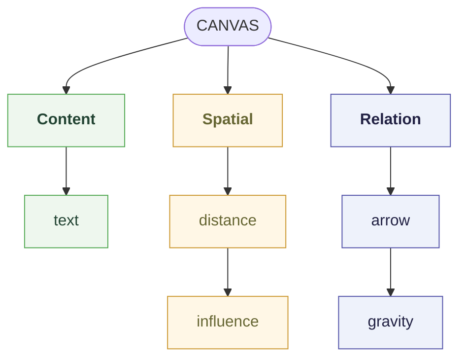
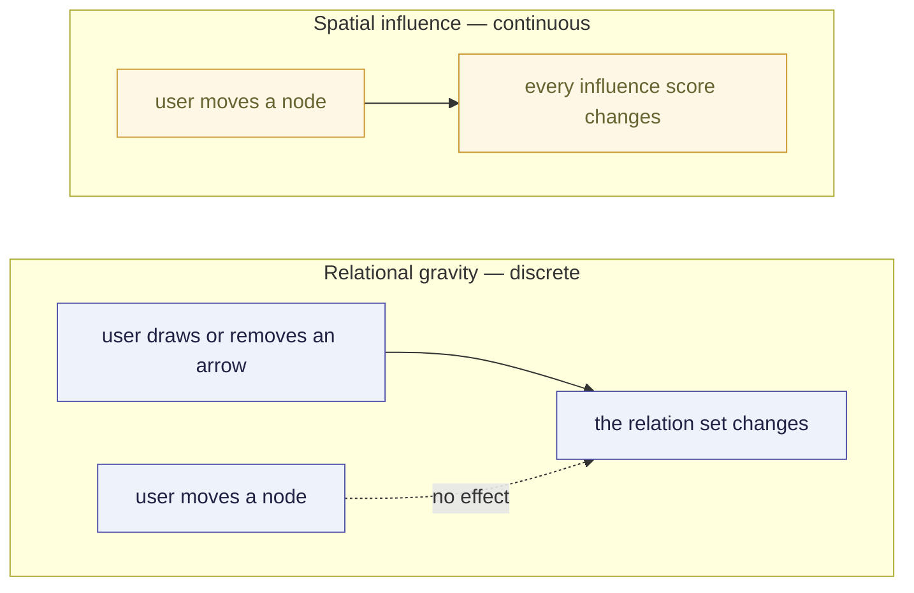
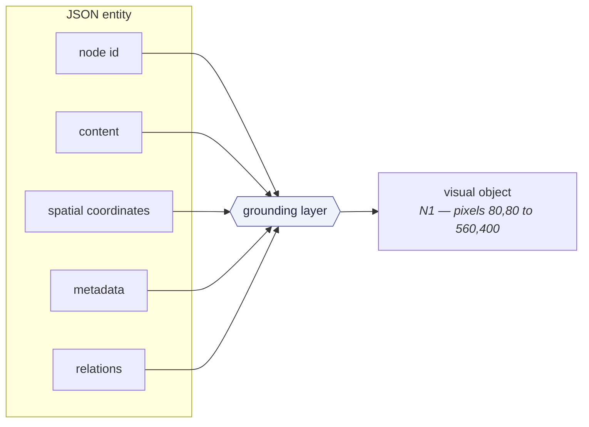
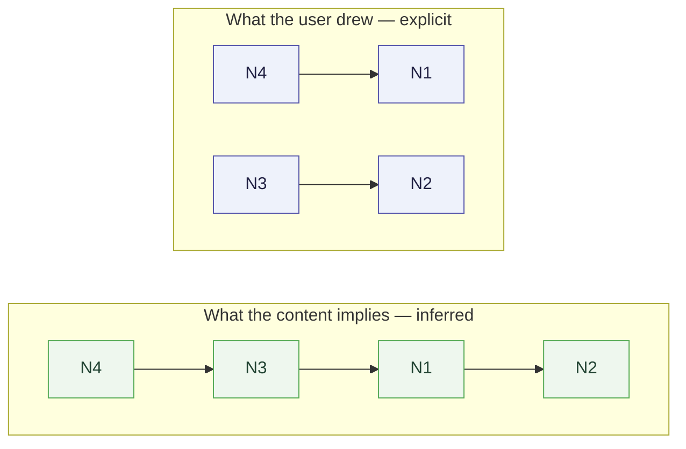
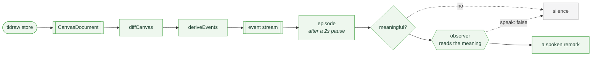
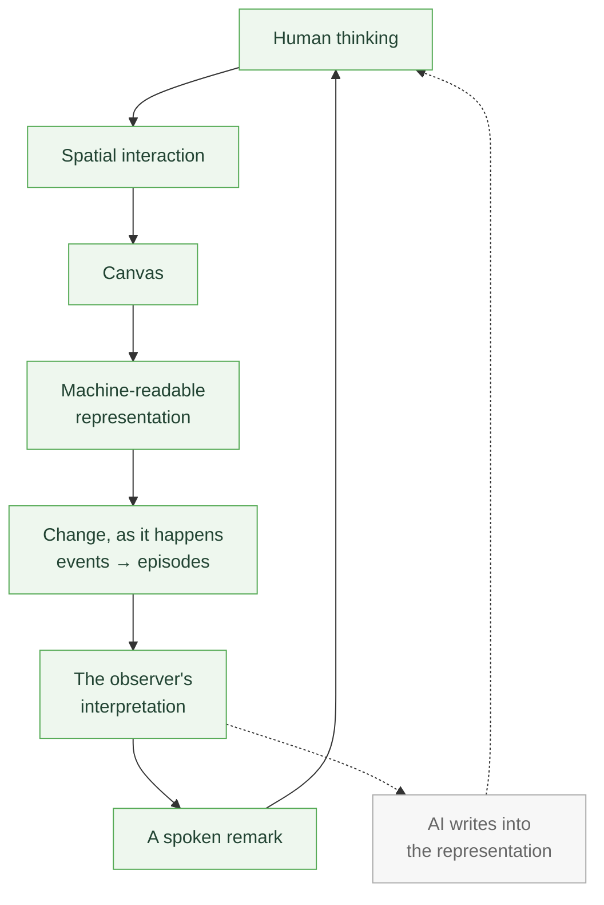
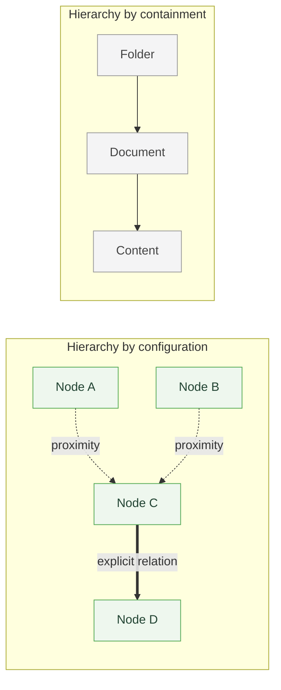

# The Representation Is the Interface

_A research note on why this prototype exists._ It is about intent, not implementation — the
[README](../README.md) documents the system that was actually built, and
[`CODEMAP.md`](../CODEMAP.md) says where each piece of it lives.

This didn't arrive out of nowhere. I have been reading about representation and testing ideas with
small prototypes for a while — particularly how people represent complex problems, what role spatial
arrangement plays in thinking, and what a multimodal model could do with either. One idea kept
pulling harder than the rest:

> **Representation might not just be the output of thinking. It might be part of the thinking
> itself.**

When someone puts an idea on paper, in a diagram, or on a canvas, they are not only recording a
thought. They are getting it out of their head, moving it closer to something, pulling it apart,
grouping it, connecting it. What changes the thought is often not its content but where it sits and
what it sits beside.

Which led to the question this prototype is a test of:

**What happens if an AI can observe that representation directly?**


---

## The primitives

I kept the building blocks deliberately small. The goal was never to model every way of thinking —
it was to build a substrate narrow enough to actually test the hypothesis on.

| Primitive              | What it carries                                                | Where it lives              | Status         |
| ---------------------- | -------------------------------------------------------------- | --------------------------- | -------------- |
| **Ideas**              | The content of a thought — a note, a question, a claim         | `nodes[].content`           | Built          |
| **Images**             | Thinking isn't only words: a photo, a reference, a visual idea | —                           | **Planned**    |
| **Semantic relations** | The connection the user drew, and what they called it          | `relations`                 | Built          |
| **Spatial relations**  | Distance, proximity, grouping — arrangement as a signal        | `spatialContext.influences` | Built          |
| **Context**            | The field around an idea, rather than the idea alone           | `contextualField.radius`    | Built          |
| **Attention**          | What the user selects, focuses on, is working on               | —                           | **Planned**    |
| **Change**             | How all of the above evolves while someone thinks              | the event stream            | Built, spatial |

Two of those are honestly empty, and this note marks them rather than implying them.

**Images are planned.** `NodeType` has exactly one concrete member, `post_it`. The Node abstraction
was built to take more — content is generic at the Node level precisely so an image source or an
article URL can sit beside `text` later — but nothing has been added to it yet, so today every idea
on this canvas is words.

**Attention is planned too**, and it is the more interesting gap. Selecting a note already changes
what the canvas _shows_ you — the field highlights, the influence badges appear — but selection
never enters the representation. It is not in `CanvasDocument`, it emits no event, and
`readEpisodeContext` never sends it to the observer. So the AI can see that you moved something and
cannot see what you are looking at, which is exactly half of the thing this note argues matters.

**Change is built, but only the spatial half of it.** Moves, fields and relations are all reported;
editing a note's text is not. More on that below, because the omission is deliberate.

---

## Three kinds of evidence, kept apart

The three primitives that _are_ built are not the same kind of information, and the design's first
commitment is that they never get collapsed into one:



They have different epistemic statuses:

| Signal                 | What does it tell us?                                | Strength          |
| ---------------------- | ---------------------------------------------------- | ----------------- |
| **Content**            | What does the node say?                              | Semantic evidence |
| **Spatial influence**  | How are nodes organized in space?                    | Implicit signal   |
| **Relational gravity** | What relationship did the user explicitly establish? | Explicit signal   |

What makes this a real research question rather than a schema decision is that semantic and spatial
structure genuinely disagree. Two ideas can sit right next to each other with no conscious
relationship between them. Two ideas can be far apart on the canvas and be the pair most strongly
connected in the user's head. Collapsing both into one notion of "related" destroys the only signal
worth having.

So the representation lets a model reason across all three while keeping their provenance distinct.
**Spatial influence** is `spatialContext.influences`; **relational gravity** is `relations` — an
arrow carrying `meta.relation` — and each relation states its strength as a `gravity` between `0`
and `1`. Two numbers, deliberately never combined in place. If you want to read the code rather than
the argument, those are the names to grep for.

---

## Context is a field, not a point

I don't think the meaning of something on a canvas comes only from the thing itself. The space
around an idea, the other ideas near it, and what the user is doing in that area are all part of
what it means. So rather than looking at an idea alone, the model looks at a **context field** that
forms around it.

Concretely: a Node may declare a radius, and proximity becomes a continuous signal rather than a
binary one. Nodes have positions, distances, and an influence value derived from those distances.


This is deliberately not an edge. **Spatial proximity is an implicit signal of organization.** It
does not mean:

> "These two concepts are semantically related."

It means:

> "The user has positioned these things within a particular spatial context."

That distinction is most of the work when interpreting a canvas.

It is also directional, which is easiest to see on the canvas itself. Selecting a node badges every
node it is spatially related to, in both directions at once:

```text
→ 0.167     how much the selected node reaches this one
← 0.375     how much this one reaches the selected node
500 u       centre-to-centre distance — symmetric, so stated once
```


Two nodes with different reach influence each other by different amounts. That asymmetry is a fact
about the layout, and no semantic relation is involved in it anywhere.

---

## A relation is a different claim entirely

Connecting two things isn't just linking them. It is saying there is a specific relationship there —
and that it came from the user rather than from the arrangement.

When a user draws an arrow from one node to another, the system records that relation separately
from spatial proximity.


The arrow is a form of **relational gravity**: a user-authored force that explicitly establishes a
connection. What the canvas above says, in the canonical JSON:

```json
"relations": {
	"r1": { "id": "r1", "from": "n4", "to": "n1", "gravity": 1, "type": "constrains" },
	"r2": { "id": "r2", "from": "n3", "to": "n2", "gravity": 1 }
}
```

The second relation has no `type`, and that absence is deliberate. An unlabelled arrow means
"connected, and the user didn't say why", which is a different claim from `related_to` — inventing
that word would be exactly the inference this representation refuses to make.

`gravity` is how strongly the user says the relation holds, and both of these are at `1` because
drawing an arrow deliberately is the strongest assertion the tool offers — the number is the force
made explicit rather than assumed. It can be turned down to say "related, but loosely", and nothing
about the layout moves it: unlike `influence`, it is not a function of where the notes sit.

A relationship stays strong even when the user drags the nodes apart, while spatial influence
changes continuously as they move. The two layers therefore respond to entirely different events:



---

## Grounding

If the AI is going to be multimodal about this — to see the canvas as well as read it — then the
machine-readable representation has to be explicitly tied to the rendered one.

Each node has a stable identity and can be mapped to a specific visual object:



This removes an important ambiguity. Instead of asking the model to work out for itself that a JSON
object corresponds to a particular region of an image, the representation states the mapping.

The model can therefore reason about:

> **N3 → this exact visual object → this exact position → this exact content → these exact
> relationships.**

In practice that means an exported PNG with every node outlined and labelled, and a JSON block that
says which label is which id:


```json
"grounding": {
	"image": { "width": 1440, "height": 1477 },
	"nodes": {
		"N1": { "nodeId": "aeb30231-…", "bbox": [80, 80, 560, 400] },
		"N2": { "nodeId": "cb19cf1f-…", "bbox": [880, 160, 1360, 480] }
	}
}
```

One note on counting, because it is the first thing that looks like a contradiction: this note
describes **three** kinds of evidence, while the README documents
[four layers of context](../README.md#four-layers-of-context). Both are right. Grounding is not a
fourth signal about meaning — it is an index from the representation into screenshot pixels, and it
gets its own layer precisely because it speaks in a different coordinate system from the other
three.

### What the Gemini tests showed — an informal observation

I tested the representation by giving Gemini both the **grounded visual canvas** and the
**machine-readable JSON**, then asking it to reason over the environment in several ways: ground
each entity to its visual object, reason about position and proximity, compare conceptual
relationships against the spatial organization, and separate relations that were explicitly drawn
from ones merely inferable from content or distance.

This was hand-run, and **no transcripts or fixtures from it are checked into this repository** —
read it as the reason the design felt worth continuing, not as a result. The canvas below is a
**reconstruction** of the structure I was testing; the sessions themselves left nothing behind.


The model could identify the explicit structure the arrows assert while independently deriving a
different structure from the content of the notes:



The interesting result is not that the model found the "correct" graph. It is that the
representation let it **see the disagreement between two layers of evidence** instead of averaging
them into one. That is a much more interesting capability.

---

## The representation is not static

This is the part I find most interesting, and it is where the design stops being a schema.

Representation isn't a thing you arrive at. It is a thing that changes while you think:

I move an idea.  
I bring another idea next to it.  
I make a connection.  
I select one and work on it.  
Then I change my mind.

For an AI, the most important information might not be the final state of the canvas at all. It
might be the **process of change** — which means the representation has to make change observable,
not just state.

(Line four of that list is the one that isn't there. Selecting something and working on it is
attention, and attention leaves no trace in the representation — so of those five moves, the
prototype can see four.)

It does, and it does it without keeping a second copy of anything. `diffCanvas(before, after)` is
handed two documents rather than holding a history; `deriveEvents` restates that diff as an ordered
event stream; and because a continuous drag emits an event per store tick, the events are then
grouped into an **episode** — everything between one pause and the next, folded into a single
before → after that reads like one gesture.


The panel above is the whole argument in one screenshot: a note dragged far out of range, its
spatial influence collapsed to `0.000`, and the relation the user drew still standing at `1.00`.
Proximity and intent moved independently, and the stream reported them independently — never a
`relation_deleted`, because moving a note cannot revoke a claim the user made.

**Editing a note's text emits no event, and that is a decision rather than an oversight.** The event
vocabulary is deliberately spatial. A `content_changed` event would be the first one that isn't, and
semantic structure is the part of this picture the model still refuses to claim — so there is no
event for it to claim with. It is pinned by a test so it stays a decision. It is also, along with
attention, the most obvious thing missing.

---

## The AI decides when to speak

The AI's role here isn't to comment on everything. It observes the changes, interprets them in
context, and decides whether any of it is actually worth saying. The user makes a few changes,
pauses, and if there is something worth pointing out, the companion says it.



Two gates, and they answer different questions. The first is local, cheap and deliberately dumb: an
episode carrying no structural change and only sub-threshold influence nudges is dropped before it
reaches the network. Everything that survives is worth _asking_ about — and the model then decides
whether it is worth _speaking_ about. **Silence is a first-class answer**, returned as structured
output rather than detected in prose, and it is the normal outcome for most episodes.

What the observer receives is not raw ids. The episode's `NodeId`s are resolved against the live
canvas into the notes' own text, along with every relation currently touching them — including
arrows drawn ten episodes ago, because "you pulled them apart but kept the connection" is only
legible if the arrow is in the picture. The last few remarks ride along too, so it varies its
phrasing instead of narrating the same trend at every pause.

Then I combined this with voice. I make a few changes on the canvas, pause, and the companion may
say something — sometimes about a connection, sometimes about two ideas drawing together, sometimes
just an observation about the thing I am working on. The words are released as the voice says them,
so the sentence arrives at the pace it is spoken rather than sitting silently on screen waiting for
audio.


Both of those are what the model actually said to the canvas underneath them. The transcript reads
newest first, so the one on top came second — an arrow drawn to a note on the far side of the
canvas, which is exactly the case the separation of signals exists for: proximity says those two
are unrelated, and the user has just said otherwise. The one below it came first, from three notes
drifting into one another's fields.

The pause before it speaks is real and it is measured: about two seconds for the episode to close,
about three for the model to decide, about two more to synthesise the voice. Roughly six and a half
seconds from "user stops dragging" to the first sound. A hint covers the last four of those, naming
the job it is on rather than spinning.

This feels quite different from a chatbot. I'm not handing the model a prompt — I'm building a
representation, and it is watching that representation change.

---

## The representation becomes a shared space

Which brings up the claim I actually care about.

**The representation becomes a shared space between the human and the AI.** The human manipulates
it. The AI observes and interprets it. What the AI says changes the human's thinking, which changes
the representation again. The interaction stops being a one-way `input → output` relationship and
becomes a loop.



Green is what runs today. The loop does close — but it closes **through the human**. The AI can
observe the representation and speak about it; it cannot yet reach into it. Adding an idea, drawing
a relation, proposing a grouping — the grey arrow — is the obvious next step and none of it exists.

An observer in that position could notice more than it currently does:

- two semantically related ideas that have become spatially separated,
- a cluster forming around a concept,
- an explicit relation that conflicts with the surrounding spatial structure,
- an unexplored gap between two conceptual clusters,
- a new pattern emerging from how the user is manipulating the canvas.

It could then add information, create entities, propose relations, or generate new representations
directly into the space.

---

## What isn't built

Being specific about this is most of the value of a note like this one.

| Missing                    | What it would take                                                                                               |
| -------------------------- | ---------------------------------------------------------------------------------------------------------------- |
| **Image nodes**            | A second `NodeType` with its own shape util and tool. The Node abstraction was built for it; nothing uses it yet |
| **Attention**              | Selection and focus entering `CanvasDocument` and the episode, rather than only driving the overlay              |
| **Semantic change events** | A `content_changed` event — the first non-spatial one, which is why it hasn't been added lightly                 |
| **AI write-back**          | The grey arrow above. The companion can speak about the representation; it cannot modify it                      |
| **A relation vocabulary**  | `explains`, `supports`, `contradicts` as known types, rather than whatever word the user typed                   |

Nothing about the current prototype answers the hypothesis. It is a system that works well enough to
let me think about it.

---

## Where this points

Underneath the canvas experiment there is a broader claim about structure:

**A canvas can be treated as a spatial computational substrate rather than merely a rendering
surface.** Traditional digital environments organize information mostly through explicit hierarchy.
Here, structure comes from configuration instead:



Something doesn't need to be _inside_ a folder to belong to the same conceptual context. It may
simply need to **converge spatially** with other entities.

And the broader hypothesis:

> **If we turn an interactive environment into an explicit machine-readable representation, AI can
> reason over the environment itself rather than only over the content rendered inside it.**

This connects naturally to the **Tools for Thought** tradition. The goal is not to replace the
human's thinking with an AI system. It is to give the AI access to the same external representational
space the human is already thinking in, and let it participate there.

Which is why I no longer think the interesting framing is:

> _"What happens when AI is given a representation of thinking rather than a prompt?"_

**The canvas is not the interface to the AI. The representation is.** The canvas is the environment
where the human thinks; the representation is the common ground where the human and the AI observe
the same thinking process in different ways. So the question goes one step further:

> _"What happens when AI shares the representation through which our thoughts are evolving?"_

I don't know where that goes yet. But it is a more interesting thing to explore than
`input → model → output`, and this prototype exists to make it testable rather than to answer it.
