# From Canvas to a Machine-Readable Thinking Space

_A research note on why this prototype exists._ It is about intent, not implementation — the
[README](../README.md) documents the system that was actually built, and
[`CODEMAP.md`](../CODEMAP.md) says where each piece of it lives.

I started with a simple question:

**What changes when a 2D canvas is not treated merely as a visual interface, but as a structured
representation of human thought that an AI can directly reason over?**

The prototype explores this by converting a canvas into a machine-readable representation and
explicitly grounding that representation back to the visual environment.

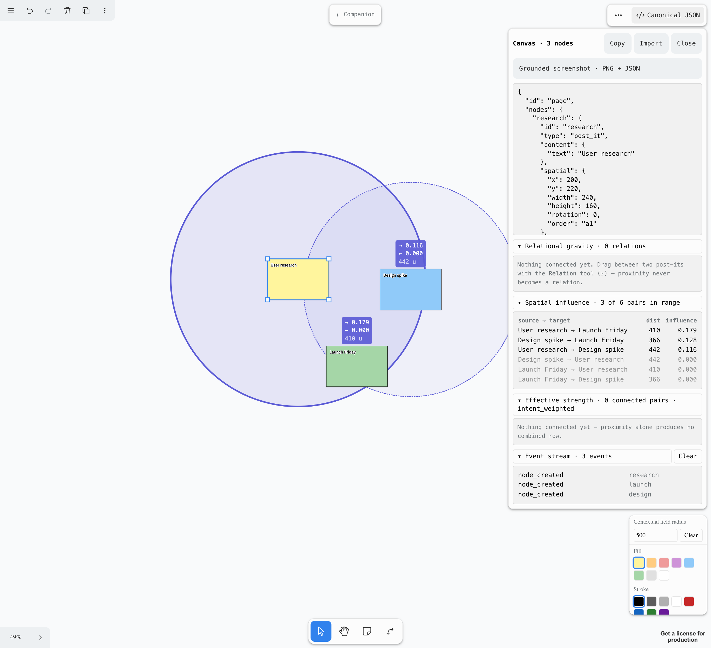

The current representation contains **three distinct kinds of information**:


These signals have different epistemic statuses:

| Signal                 | What does it tell us?                                | Strength          |
| ---------------------- | ---------------------------------------------------- | ----------------- |
| **Content**            | What does the node say?                              | Semantic evidence |
| **Spatial influence**  | How are nodes organized in space?                    | Implicit signal   |
| **Relational gravity** | What relationship did the user explicitly establish? | Explicit signal   |

The important part is that **these signals should not be collapsed into a single notion of
“relationship.”**

A node can be semantically related to another node without being spatially close. Two nodes can be
spatially close without having an explicit relationship. And an explicit relation can exist even
when two nodes are physically distant.

The representation therefore allows an LLM to reason across these signals while keeping their
provenance distinct.

The two terms above are the note's language; the model spells them differently. **Spatial
influence** is `spatialContext.influences` in the canonical JSON, and **relational gravity** is
`relations` — an arrow carrying `meta.relation`. If you want to read the code rather than the
argument, those are the two names to grep for.

---

## Grounding

The machine-readable representation is explicitly grounded to the rendered canvas.

Each node has a stable identity and can be mapped to a specific visual object:

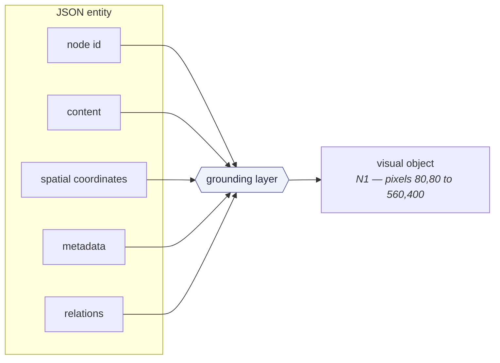

This removes an important ambiguity for multimodal models.

Instead of asking the model to independently determine that a JSON object corresponds to a
particular region of an image, the representation establishes that mapping explicitly.

The model can therefore reason about:

> **N3 → this exact visual object → this exact position → this exact content → these exact
> relationships.**

In practice that means an exported PNG with every node outlined and labelled, and a JSON block that
says which label is which id:

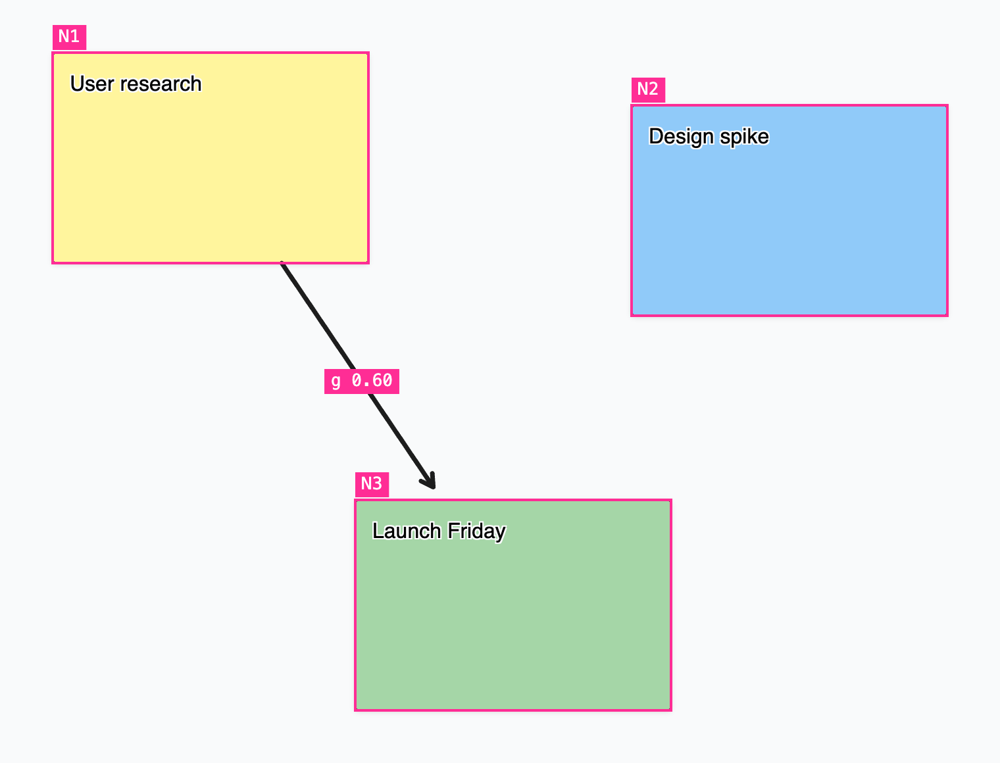

```json
"grounding": {
	"image": { "width": 1440, "height": 1477 },
	"nodes": {
		"N1": { "nodeId": "aeb30231-…", "bbox": [80, 80, 560, 400] },
		"N2": { "nodeId": "cb19cf1f-…", "bbox": [880, 160, 1360, 480] }
	}
}
```

One note on counting, because it is the first thing that looks like a contradiction: the opening
section above describes **three** kinds of information, while the README documents
[four layers of context](../README.md#four-layers-of-context). Both are right. Grounding is not a
fourth signal about meaning — it is an index from the representation into screenshot pixels, and it
gets its own layer precisely because it speaks in a different coordinate system from the other
three.

---

## Spatial Influence

The prototype also models spatial proximity as a continuous signal rather than a binary
relationship.

Nodes have positions, distances between them, and an influence value derived from those distances.

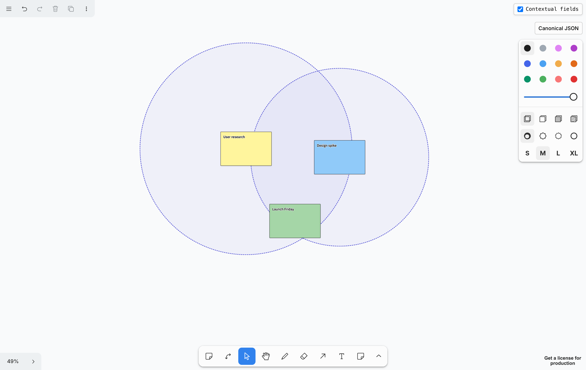

This creates something different from an explicit edge.

**Spatial proximity acts as an implicit signal of organization.**

It does not necessarily mean:

> “These two concepts are semantically related.”

Instead, it means:

> “The user has positioned these things within a particular spatial context.”

That distinction becomes important when interpreting a canvas.

It is also directional, which is easiest to see on the canvas itself. Selecting a node badges every
node it is spatially related to, in both directions at once:

```text
→ 0.167     how much the selected node reaches this one
← 0.375     how much this one reaches the selected node
500 u       centre-to-centre distance — symmetric, so stated once
```

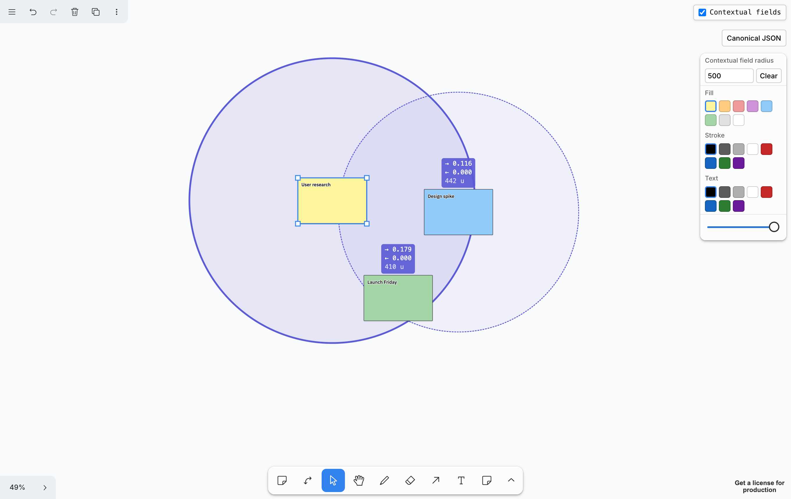

Two nodes with different reach influence each other by different amounts. That asymmetry is a fact
about the layout, and no semantic relation is involved in it anywhere.

---

## Relational Gravity

The next layer introduces explicit relations.

When a user draws an arrow from one node to another, the system records that relation separately
from spatial proximity.

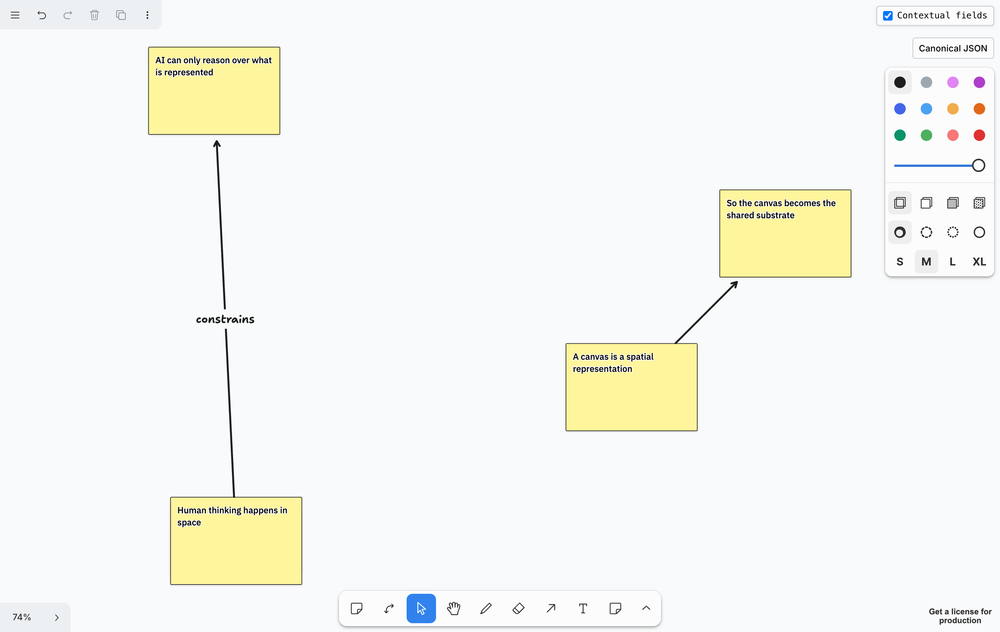

The arrow therefore becomes a form of **relational gravity**: a user-authored force that explicitly
establishes a connection between entities. What the canvas above says, in the canonical JSON:

```json
"relations": {
	"r1": { "id": "r1", "from": "n4", "to": "n1", "type": "constrains" },
	"r2": { "id": "r2", "from": "n3", "to": "n2" }
}
```

The second relation has no `type`, and that absence is deliberate. An unlabelled arrow means
“connected, and the user didn't say why”, which is a different claim from `related_to` — inventing
that word would be exactly the inference this representation refuses to make.

This is fundamentally different from proximity.

A relationship can remain strong even if the user moves the nodes apart, while spatial influence
should change continuously as the nodes move. The two layers therefore respond to entirely
different events:

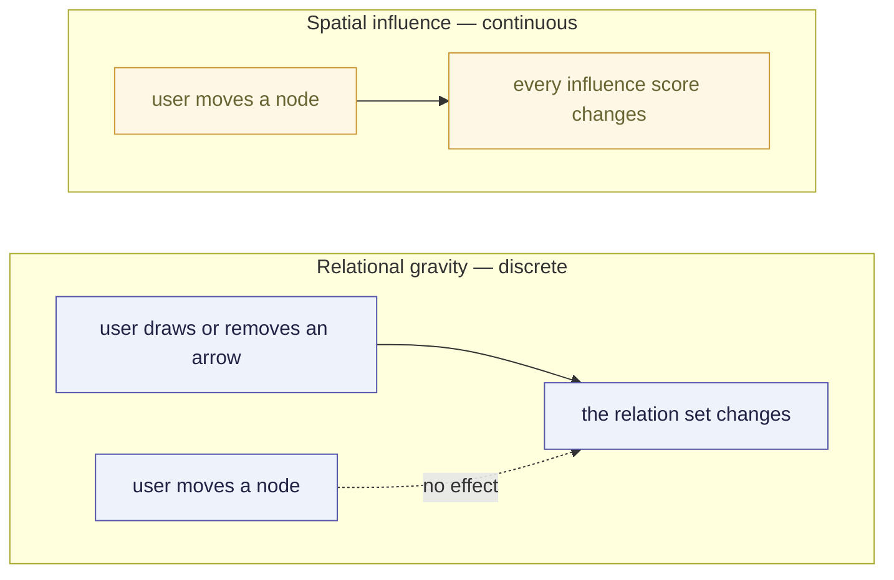

---

## What the Gemini tests showed — an informal observation

I tested the representation by giving Gemini both the **grounded visual canvas** and the
**machine-readable JSON representation**, then asking it to reason over the environment in several
different ways.

This was hand-run, and **no transcripts or fixtures from it are checked into this repository**. What
follows is a recorded impression rather than something reproducible from this checkout — read it as
the reason the design felt worth continuing, not as a result.

The tests included:

1. **Entity grounding** — identify which JSON node corresponds to which visual object.
2. **Spatial analysis** — reason about position, distance, proximity, and influence.
3. **Semantic vs. spatial reasoning** — compare conceptual relationships with the spatial
   organization.
4. **Explicit vs. inferred structure** — distinguish relations explicitly represented by arrows from
   relationships inferred from content or proximity.

The results were encouraging.

Gemini was able to correctly map entities to visual objects, recover explicit directional
relationships, reason about spatial proximity, and—most importantly—**distinguish explicit
relationships from spatially or semantically inferred ones**.

The canvas in the previous section is a **reconstruction** of the structure I was testing — the
sessions themselves left nothing behind, so what follows is that shape rebuilt, not the artifact the
model was handed. Grounded, it is the kind of thing the model reads: labels and arrows in one image,
and JSON keyed to those same labels.

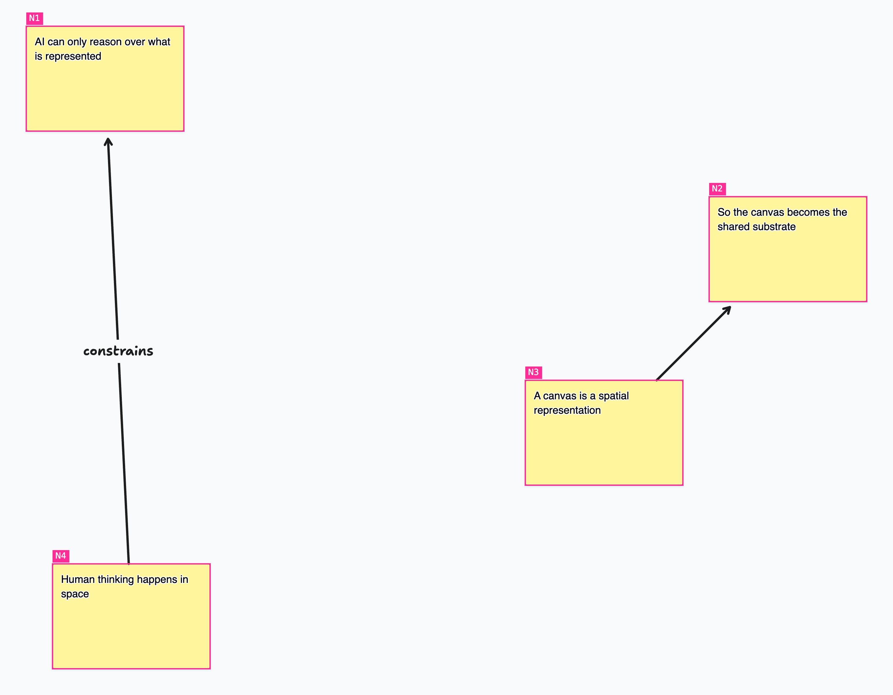

The model could identify the explicit structure the arrows assert, while independently deriving a
different structure from the content of the notes:

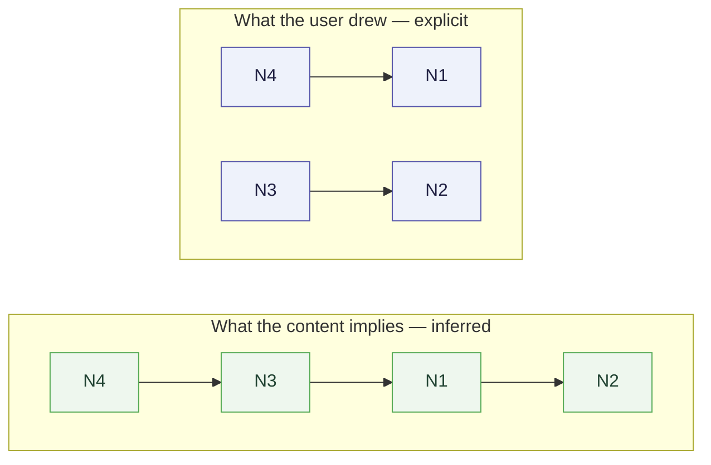

The interesting result is not that the model found the “correct” graph.

It is that the representation allowed the model to **see the disagreement between different layers
of evidence**.

That is a much more interesting capability.

---

## The Emerging Paradigm

This suggests a broader direction:

**A canvas can be treated as a spatial computational substrate rather than merely a rendering
surface.**

Traditional digital environments tend to organize information primarily through explicit hierarchy.
The prototype explores a different model, where structure comes from configuration instead:

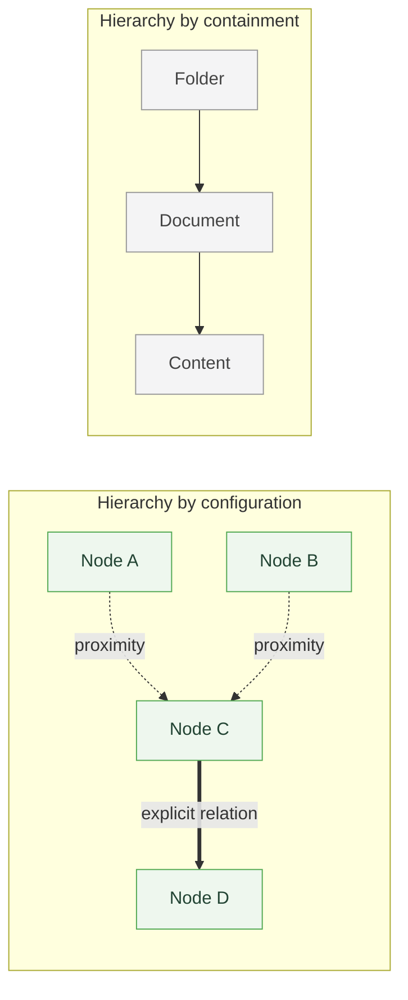

Here, hierarchy does not necessarily come from containment.

**Meaning can emerge from spatial configuration, proximity, explicit relations, and content
together.**

Something does not necessarily need to be _inside_ a folder to belong to the same conceptual
context.

It may simply need to **converge spatially** with other entities.

---

## Toward AI as a Thinking Companion

This also changes the role of the AI.

Instead of `User → Chat → AI → Answer`, the interaction could become a loop over the representation
itself:

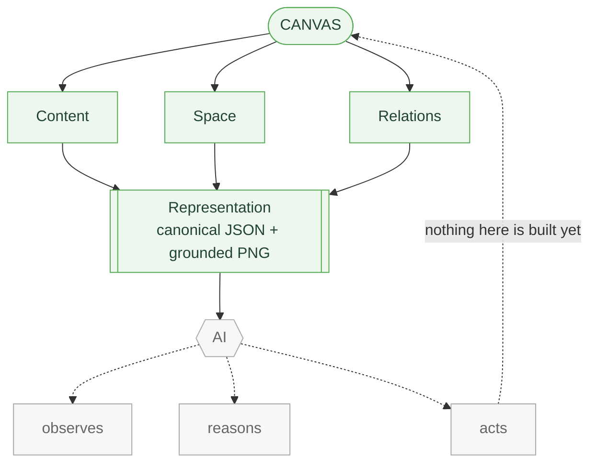

The green half of that diagram exists today. **Everything from the AI onward does not** — the rest
of this section is where the prototype is pointed, not what it does.

An AI in that position would no longer be simply responding to explicit prompts. It could
continuously observe how the representation changes as the user works:

- A user moves a node → spatial influence changes.
- A user connects two nodes → relational gravity changes.
- A user adds content → semantic structure changes.

Observing those changes as a stream is what would let it act as a **context-aware thinking
companion** rather than a chatbot. It could notice:

- two semantically related ideas that have become spatially separated,
- a cluster forming around a concept,
- an explicit relation that conflicts with the surrounding spatial structure,
- an unexplored gap between two conceptual clusters,
- or a new pattern emerging from the user's manipulation of the canvas.

It could then add information, create entities, propose relations, or generate new representations
directly into the space.

---

## The Larger Research Direction

This is where the prototype starts to become more than a canvas experiment.

The broader hypothesis is:

> **If we turn an interactive environment into an explicit machine-readable representation, AI can
> reason over the environment itself rather than only over the content rendered inside it.**

The canvas becomes a kind of **externalized representational system**, and the research path is a
loop rather than a pipeline:

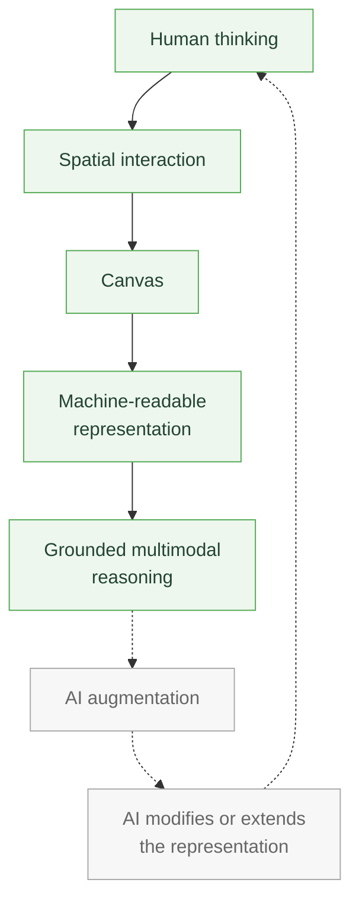

Green is in place today, with one caveat: the grounded multimodal reasoning step has only been
hand-run — an export pasted into a model — rather than automated anywhere in the prototype. Grey does
not exist at all.

This connects naturally to the **Tools for Thought** tradition.

The goal is not to replace the human's thinking process with an AI system.

It is to give the AI access to the same external representational space in which the human is
already thinking—and allow it to augment that space.

The prototype therefore starts from a relatively narrow question—**what happens when a 2D
environment becomes grounded and machine-readable?**—but opens a much larger research space around
spatial representations, relational structure, multimodal reasoning, dynamic environments, and
AI-augmented thinking.

And importantly, the current prototype does **not** attempt to solve all of these problems.

It establishes a substrate on which those questions can be tested.
